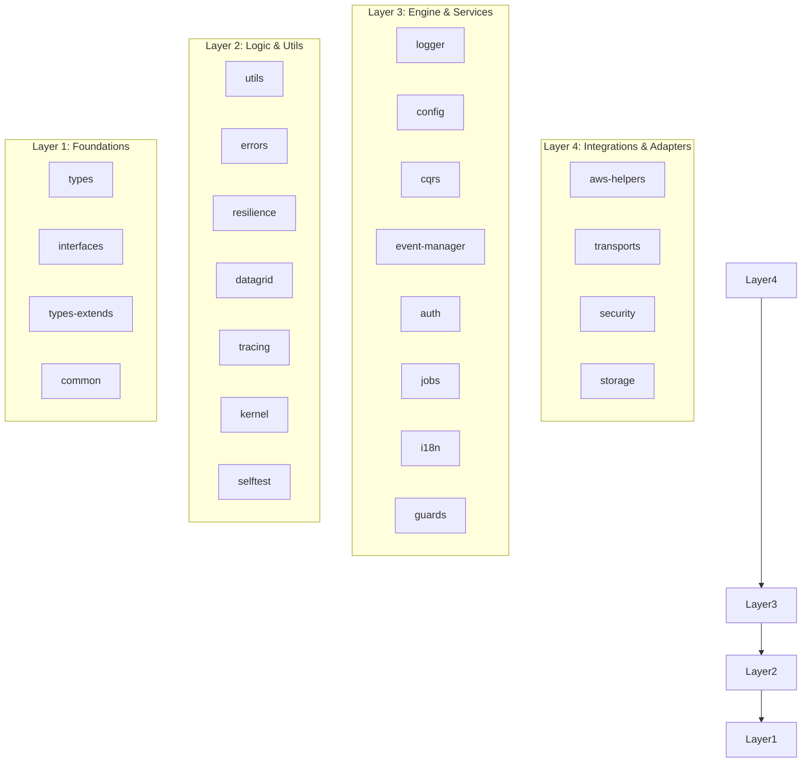

# `@node-yalc` — Framework-Agnostic Node.js Core Utilities

> **Node-YALC**: Pure TypeScript & Node.js shared core library collection. Designed to be completely framework-agnostic, zero-overhead, and shared across standalone microservices, Ferrox-Node applications, and NestJS services.

[](https://opensource.org/licenses/AGPL-3.0)
[](https://www.typescriptlang.org/)

---

## 1. 🧠 Philosophy & Purpose

Il core principle di `@node-yalc` è l'astrazione assoluta da qualsiasi framework web (Fastify, Express, NestJS). Nasce per ospitare tutta la business logic, la gestione della sicurezza (Sentinel, PASETO), l'integrazione di servizi cloud (AWS) e il controllo degli errori in pacchetti modulari e agnostici. L'obiettivo è permettere il riutilizzo del codice di dominio tra `ferrox-node` e `nestjs-yalc` senza frizioni o dipendenze incrociate.

## 2. 🧅 Architectural Layering

`@node-yalc` organizza le sue 23 librerie interne secondo una struttura a strati non sovrapposti per evitare cicli di dipendenza:



## 3. ⚙️ How it Works

L'infrastruttura è costruita come un **Monorepo NPM Workspace**. Ogni sottomodulo vive nella propria cartella, con il proprio codice sorgente TypeScript `src/` e le proprie dichiarazioni. I build script globali (es. `build.mjs`) orchestrano la compilazione di `tsc` centralizzata e distribuiscono i file `.js` e `.d.ts` nella cartella `dist/` di ciascun sottomodulo. In produzione o durante lo sviluppo locale, l'intero pacchetto può essere pubblicato su uno store locale Yalc (`npx yalc publish`) o collegato come Git Submodule.

## 4. 📐 Why it was designed this way

L'approccio modulare interno è stato adottato per garantire:
- **Zero Overhead**: Importi solo ciò che ti serve.
- **Portabilità Universale**: Il codice non è accoppiato a decoratori specifici di NestJS o oggetti Request/Response di Express.
- **Isolamento della Sicurezza**: I moduli come `security` (per l'IA Sentinel) o `kernel` (per Landlock e AppArmor) possono essere auditati e aggiornati indipendentemente dal resto del sistema.
- **Determinismo**: Integrandolo come Submodule, i progetti downstream (come `ferrox-node`) bloccano una revisione esatta, prevenendo rotture da "floating versions" su NPM.

## 5. 📖 Usage Guide & Exhaustive 23-Package API Reference

Di seguito l'elenco completo dei 23 pacchetti presenti nel workspace:

1. **`auth`**: Gestione autenticazione con PASETO v4 e TOTP (MFA).
2. **`aws-helpers`**: Wrapper moderni su AWS SDK v3 per S3, Lambda, SSM e KMS.
3. **`common`**: Costanti globali, DTO di base condivisi.
4. **`config`**: Gestore avanzato per variabili d'ambiente (`ConfigEngine`).
5. **`cqrs`**: Implementazione del pattern Saga e Command/Query Responsibility Segregation (`CqrsSagaEngine`).
6. **`datagrid`**: Helper per impaginazione, filtri e crud operations.
7. **`errors`**: Gerarchia di eccezioni standard per il dominio (`AppError`, `DomainError`, `NotFoundError`).
8. **`event-manager`**: Motore pub/sub in-memory con tipizzazione forte (`YalcEventBus`).
9. **`guards`**: Controlli RBAC e mandatory compliance (Header HTTP di sicurezza).
10. **`i18n`**: Motore per internazionalizzazione e traduzioni sicure.
11. **`interfaces`**: Contratti astratti (es. `ILogger`, `IFerroxHttpAdapter`).
12. **`jobs`**: Schedulatore e gestione code in background.
13. **`kernel`**: API per integrazione con security module Linux (Landlock, seccomp).
14. **`logger`**: Logger strutturato ad altissime prestazioni basato su Pino, con redazione automatica (PII).
15. **`resilience`**: Implementazioni del pattern Circuit Breaker e Retry.
16. **`security`**: Integrazione avanzata Sentinel, prevenzione attacchi (es. Prompt Injection, RAG Poisoning).
17. **`selftest`**: Motore diagnostico per la verifica dell'integrità del sistema in startup.
18. **`storage`**: Wrapper unificato per l'interazione con dischi locali e blob storage.
19. **`tracing`**: Strumenti per telemetry distribuita e OpenTelemetry tracing logger.
20. **`transports`**: Adattatori HTTP e WebSockets (`ExpressHttpAdapter`, `FastifyHttpAdapter`).
21. **`types`**: Tipi fondamentali e primitive TypeScript (`Nullable`, `DeepPartial`).
22. **`types-extends`**: Helper di reflection (Type Guards avanzati).
23. **`utils`**: Funzioni pure per deep mapping, concorrenza (`p-map`), manipolazione stringhe e date.

**Esempio di Utilizzo (Logging & Errori):**
```typescript
import { createYalcLogger } from '@node-yalc/logger';
import { NotFoundError } from '@node-yalc/errors';

const logger = createYalcLogger({ level: 'debug', redact: ['password'] });
logger.info("Initializing...");

throw new NotFoundError("Utente non trovato", { userId: 123 });
```

## 6. ⚠️ Anti-Patterns (Cosa NON fare)

- ❌ **Accoppiare framework**: Mai importare `@nestjs/common` o oggetti `express` all'interno di `@node-yalc/utils` o `@node-yalc/domain`.
- ❌ **Dipendenze Circolari**: Evitare che `layer1` (es. `types`) importi da `layer3` (es. `logger`). Seguire rigorosamente la topologia architetturale.
- ❌ **Console.log**: Mai utilizzare `console.log` nativo; usare sempre `ILogger` / `@node-yalc/logger` per assicurare la redazione sicura dei dati sensibili (PII/Token).

## 7. 💡 Pro-Tips & Best Practices

- **Testing Modulare**: Quando aggiungi helper in `utils`, accompagnali sempre con unit test puri che non richiedono database.
- **Redazione Sicura**: Configura sempre il `logger` specificando i field da redigere (es. `['authorization', 'credit_card']`) per l'intero applicativo.
- **Submodule Sync**: Quando tiri modifiche da remoto in `ferrox-node`, esegui `git submodule update --init --recursive` per allineare l'hash di `node-yalc` al commit atteso.
- **Yalc Locale**: Usa `npx yalc push` durante lo sviluppo di `node-yalc` se devi provarlo live in un progetto esterno prima del commit.

