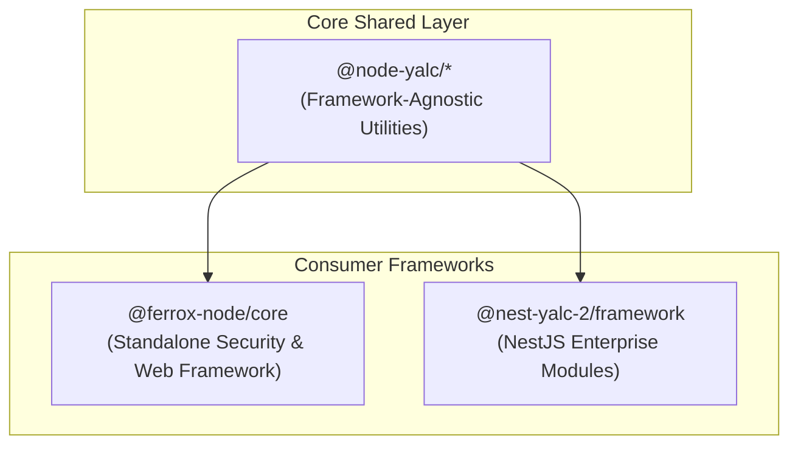

# `@node-yalc` — Framework-Agnostic Node.js Core Utilities

> **Node-YALC**: Pure TypeScript & Node.js shared core library collection. Designed to be completely framework-agnostic, zero-overhead, and shared across standalone microservices, Ferrox-Node applications, and NestJS services.

[](https://opensource.org/licenses/AGPL-3.0)
[](https://www.typescriptlang.org/)

---

## 📌 Architecture & Role

`@node-yalc` is the fundamental building block of the ecosystem. It contains no web framework dependencies (no NestJS, Express, or Fastify bindings), ensuring that core domain logic, type definitions, error handlings, logging, and security primitives remain **clean, reusable, and portable**.



---

## 📦 Workspace Packages

The repository is structured as an NPM workspace containing 9 modular packages:

| Package | Scope | Description |
| :--- | :--- | :--- |
| **`@node-yalc/types`** | `types/` | Core TypeScript type definitions, generics, and primitive aliases. |
| **`@node-yalc/interfaces`** | `interfaces/` | Abstract contracts for logging, event dispatching, and system lifecycle hooks. |
| **`@node-yalc/types-extends`** | `types-extends/` | Advanced type utilities, type guards, and reflection helpers. |
| **`@node-yalc/logger`** | `logger/` | High-performance Pino-based structured logger with sensitive data redaction. |
| **`@node-yalc/utils`** | `utils/` | Pure utility functions for object mapping, async concurrency (`p-map`), and serialization. |
| **`@node-yalc/errors`** | `errors/` | Standardized application error hierarchy (`AppError`, `DomainError`, `ValidationError`). |
| **`@node-yalc/event-manager`** | `event-manager/` | In-memory & pub-sub event emitter engine with typed event payloads. |
| **`@node-yalc/common`** | `common/` | Shared DTO schemas, constants, and base interfaces. |
| **`@node-yalc/aws-helpers`** | `aws-helpers/` | AWS SDK v3 utility wrappers for S3, SSM parameter store, and Lambda handlers. |

---

## 🚀 Building & Publishing

### 1. Build All Packages
To compile TypeScript and assemble output artifacts for all workspace packages into their respective `dist/` subdirectories:

```bash
npm run build
```

This executes `tsc` using the root `tsconfig.json` and runs `build.mjs` to distribute generated declaration and JavaScript files across all workspace packages.

### 2. Publish to Local Yalc Store
To publish all workspace packages to your local `yalc` repository store (making them instantly available to local consumer projects without symlink issues):

```bash
# Publish individual package
cd logger && npx yalc publish

# Or publish all packages via Node script
node -e "['types', 'interfaces', 'types-extends', 'logger', 'utils', 'errors', 'event-manager', 'common', 'aws-helpers'].forEach(p => require('child_process').execSync('npx yalc publish', { cwd: p }))"
```

---

## 🔗 Integration as Git Submodule

`node-yalc` is designed to be embedded directly as a Git Submodule inside consumer projects such as `ferrox-node` or `nestjs-yalc`:

```bash
# Add node-yalc as a submodule in a consumer project
git submodule add https://github.com/AI-Autistic-Intelligence/node-yalc.git node-yalc

# Initialize & update submodule
git submodule update --init --recursive
```

---

## 📜 License

AGPL-3.0-or-later © AI Autistic Intelligence Team
