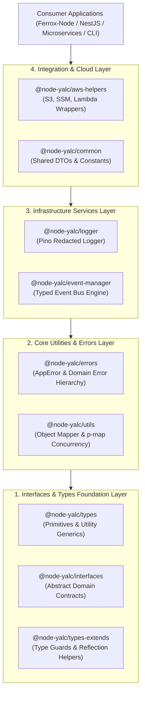

# 📦 `@node-yalc` — Framework-Agnostic Node.js Core Utilities Suite

<p align="center">
  <b>A Pure, Zero-Overhead TypeScript Shared Core Library Collection for Modern Enterprise Node.js Applications</b><br/>
  <i>Decoupling Domain Logic, Logging, Error Hierarchies, and Cloud Helpers from Web Framework Lifecycles. Surpassing Standard Monorepo Libraries in Type Safety, Performance, and Framework Independence.</i>
</p>

<p align="center">
  <a href="https://opensource.org/licenses/AGPL-3.0"></a>
  <a href="https://www.typescriptlang.org/"></a>
  <a href="https://nodejs.org/"></a>
  <a href="https://github.com/wix/yalc"></a>
  <a href="https://github.com/pinojs/pino"></a>
  <a href="https://aws.amazon.com/sdk-for-node-js/"></a>
</p>

<p align="center">
  <a href="#-1-executive-summary--architectural-rationale">Philosophy</a> •
  <a href="#-2-architectural-comparison-node-yalc-vs-traditional-shared-libraries">Comparison Matrix</a> •
  <a href="#-3-core-architecture--design-principles">Core Architecture</a> •
  <a href="#-4-exhaustive-9-package-inventory--api-reference">9-Package API Reference</a> •
  <a href="#-5-production-code-examples--tutorials">Code Tutorials</a> •
  <a href="#-6-building-yalc-publishing--submodule-workflows">Yalc & Submodules</a>
</p>

---

## 🎯 1. Executive Summary & Architectural Rationale

In enterprise software engineering, sharing utilities and domain abstractions across separate microservices or multi-framework setups (such as **Ferrox-Node** and **NestJS**) presents severe architectural challenges:

1. **Framework Pollution & Bloat**: Traditional monorepo libraries import web framework abstractions (e.g. `@nestjs/common` or `express`), forcing lightweight services to pull hundreds of megabytes of unused transitive dependencies into production bundles.
2. **Duplicate Code Drift**: Teams copy-paste logging setup scripts, custom exception classes, and AWS wrappers across projects, causing incompatible versioning and untracked bug divergence.
3. **Symlink & Module Resolution Fragility**: Using standard `npm link` or `yarn link` during local development creates broken module resolution trees, duplicated `node_modules` singletons (such as `reflect-metadata` or `rxjs`), and runtime symbol mismatches.

### **`@node-yalc` solves these problems by providing a 100% framework-agnostic shared core.**

Written entirely in pure TypeScript with **zero web-framework dependencies**, `@node-yalc` provides standardized type primitives, error hierarchies, structured loggers, event dispatchers, and AWS SDK v3 wrappers. It embeds seamlessly into consumer applications as a **Git Submodule** or via **Yalc** for zero-friction local iteration.

---

## 📊 2. Architectural Comparison: `@node-yalc` vs Traditional Shared Libraries

| Dimension / Metric | 📦 `@node-yalc/*` | 🧰 Monorepo Shared Packages | 📋 Copy-Pasted Helper Files |
|---|---|---|---|
| **Framework Independence** | **100% Pure (Zero Web Framework Bindings)** | Frequently Tight to Framework Decorators | Variable / Uncontrolled |
| **Cross-Framework Portability** | **Universal (Ferrox-Node, NestJS, Express, CLI)** | Restricted to Specific Framework | High Maintenance Overhead |
| **Sensitive Data Redaction** | **Native Pino Redaction Rules** | Manual `console.log` Filtering | None / Security Risk |
| **Local Dev Workflow** | **Yalc Local Store (`npx yalc publish`)** | Fragile Symlinks (`npm link`) | Manual Copying |
| **Error Hierarchy Strictness** | **Standardized `AppError` & `DomainError`** | Inconsistent Exceptions | Raw Untyped `throw new Error()` |
| **Cloud Helper Integration** | **AWS SDK v3 Modern Modular Wrappers** | Legacy SDK v2 / Custom Scripts | Custom Unmaintained Wrappers |
| **Submodule Versioning** | **Deterministic Git Commit Hash Binding** | NPM Registry Floating Versions | Untracked Code Drift |

---

## 🧅 3. Core Architecture & Design Principles

`@node-yalc` structures core functionality into 4 strict, non-overlapping conceptual layers:



---

## 📦 4. Exhaustive 9-Package Inventory & API Reference

### 1. `@node-yalc/types` (`types/`)
Provides core TypeScript type definitions, primitive aliases, and utility generics used across all domain models.

```typescript
// Key Exported Types
type Nullable<T> = T | null;
type Optional<T> = T | undefined;
type DeepPartial<T> = { [P in keyof T]?: DeepPartial<T[P]> };
type UnboxPromise<T> = T extends Promise<infer U> ? U : T;
type KeyValuePair<K = string, V = any> = { key: K; value: V };
```

### 2. `@node-yalc/interfaces` (`interfaces/`)
Abstract domain contracts defining logger behaviors, event dispatching, and application configuration providers.

```typescript
export interface ILogger {
  info(message: string, context?: Record<string, any>): void;
  error(message: string, trace?: string, context?: Record<string, any>): void;
  warn(message: string, context?: Record<string, any>): void;
  debug(message: string, context?: Record<string, any>): void;
}

export interface IEventDispatcher<TEvent = any> {
  dispatch(event: TEvent): Promise<void>;
}
```

### 3. `@node-yalc/types-extends` (`types-extends/`)
Advanced type guards, runtime assertion helpers, and branded type generators.

```typescript
// Type Guard Helpers
export function isString(val: unknown): val is string;
export function isObject(val: unknown): val is Record<string, any>;
export function isDefined<T>(val: T | undefined | null): val is T;
```

### 4. `@node-yalc/logger` (`logger/`)
High-performance Pino-based structured logger with built-in sensitive data redaction (passwords, tokens, credit cards).

```typescript
import { createYalcLogger } from '@node-yalc/logger';

const logger = createYalcLogger({
  level: 'info',
  redact: ['password', 'authorization', 'secretToken', 'creditCard.number']
});

logger.info('User logged in successfully', { userId: 'u-101', email: 'user@example.com' });
```

### 5. `@node-yalc/utils` (`utils/`)
Pure helper functions for object mapping, async concurrency control via `p-map`, string manipulation, and payload sanitization.

```typescript
import { mapObject, runConcurrently } from '@node-yalc/utils';

// Concurrency-limited execution
const results = await runConcurrently(items, async (item) => processItem(item), { concurrency: 5 });
```

### 6. `@node-yalc/errors` (`errors/`)
Standardized application error hierarchy ensuring safe error extraction and prevention of sensitive stack trace leaks.

```typescript
import { AppError, DomainError, ValidationError, NotFoundError } from '@node-yalc/errors';

// Throw typed domain errors with status codes and payload details
throw new NotFoundError('User entity not found', { userId: 'usr-999' });
throw new ValidationError('Invalid payload attributes', [{ field: 'email', issue: 'Invalid format' }]);
```

### 7. `@node-yalc/event-manager` (`event-manager/`)
In-memory and distributed event bus dispatcher supporting typed payloads and asynchronous subscriber handlers.

```typescript
import { YalcEventBus } from '@node-yalc/event-manager';

const eventBus = new YalcEventBus();
eventBus.subscribe('user.created', async (payload) => {
  console.log('Sending welcome email to', payload.email);
});

await eventBus.publish('user.created', { id: '123', email: 'hello@ferrox.dev' });
```

### 8. `@node-yalc/common` (`common/`)
Common DTO schemas, standard HTTP status code enumerations, and system-wide constants.

### 9. `@node-yalc/aws-helpers` (`aws-helpers/`)
Modern AWS SDK v3 utility wrappers for S3 file uploads, SSM Parameter Store config fetching, and AWS Lambda event adapters.

---

## 💻 5. Production Code Examples & Tutorials

### Creating a Custom Domain Service with `@node-yalc`

```typescript
import { ILogger } from '@node-yalc/interfaces';
import { NotFoundError, ValidationError } from '@node-yalc/errors';
import { runConcurrently } from '@node-yalc/utils';

export interface UserDTO {
  id: string;
  email: string;
  role: string;
}

export class UserService {
  constructor(private readonly logger: ILogger) {}

  async processUserBatch(users: UserDTO[]): Promise<void> {
    this.logger.info(`Starting processing batch of ${users.length} users`);

    await runConcurrently(users, async (user) => {
      if (!user.email || !user.email.includes('@')) {
        throw new ValidationError(`Invalid email address for user ${user.id}`);
      }
      this.logger.debug(`User ${user.id} validated successfully`);
    }, { concurrency: 10 });

    this.logger.info('Batch processing completed successfully');
  }
}
```

---

## 🛠️ 6. Building, Yalc Publishing & Submodule Workflows

### 1. Build All Workspace Packages
Compiles TypeScript files and distributes declaration files into package `dist/` subdirectories:

```bash
npm run build
```

### 2. Publish to Local Yalc Store
Publishes all 9 packages to your local `~/.yalc` store for instant local testing:

```bash
node -e "['types', 'interfaces', 'types-extends', 'logger', 'utils', 'errors', 'event-manager', 'common', 'aws-helpers'].forEach(p => require('child_process').execSync('npx yalc publish', { cwd: p }))"
```

### 3. Synchronize Git Submodules in Consumer Projects
To sync `@node-yalc` inside `ferrox-node` or `nestjs-yalc`:

```bash
git submodule sync
git submodule update --init --recursive
```

---

## 📜 License

AGPL-3.0-or-later © AI Autistic Intelligence Team
