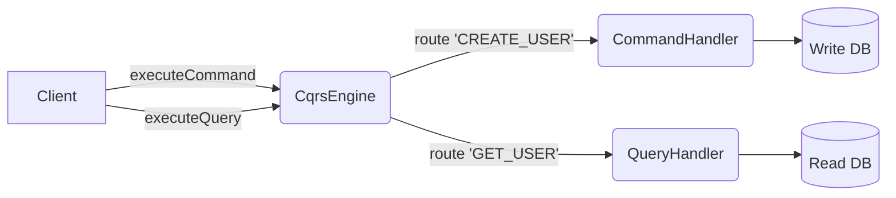
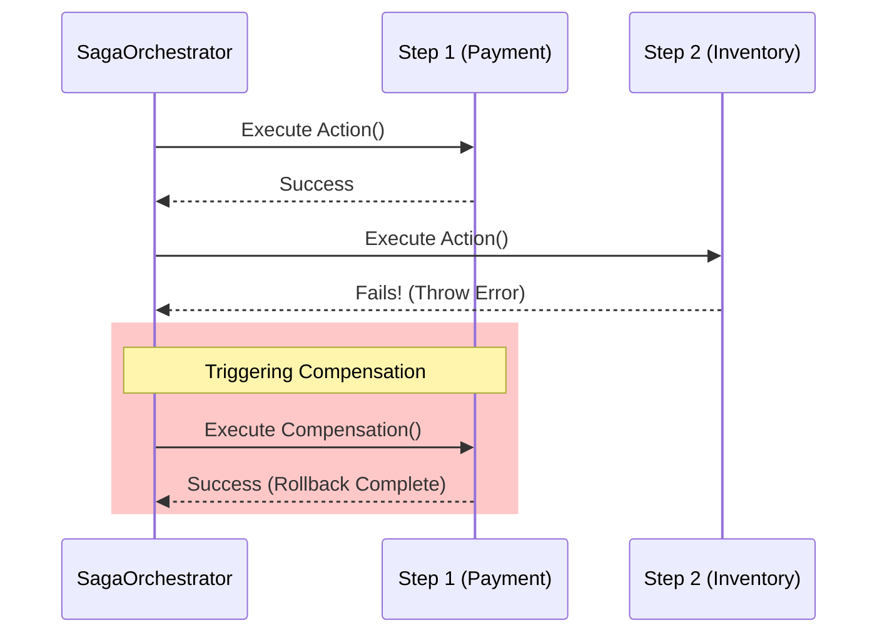

# 🏗️ CQRS & Saga Engine (`@node-yalc/cqrs`)

## 💡 1. What It Is & Architectural Purpose
The `@node-yalc/cqrs` module provides a lightweight, pure TypeScript implementation of the **Command Query Responsibility Segregation (CQRS)** pattern and **Distributed Sagas**. It serves as an architectural orchestrator that rigorously separates mutating operations (Commands) from data-retrieval operations (Queries). Additionally, it provides a built-in `SagaOrchestrator` to manage complex, multi-step distributed transactions via the Saga pattern (Compensation/Rollback).

---

## ⚙️ 2. Comprehensive Taxonomy & Key Features

| Utility | Description | Use Case |
| :--- | :--- | :--- |
| **`CqrsEngine`** | The central in-memory bus for routing Commands and Queries. | Used at the application boundary to route incoming HTTP/RPC calls to their respective handlers. |
| **`ICommand` / `IQuery`** | Strict interface contracts for operations. | Type-safe definition of intentions (`type` + `payload`/`params`). |
| **`SagaOrchestrator`** | Distributed transaction manager. | Orchestrating payments across Microservices (e.g., Deduct Funds -> Reserve Item), with automatic backwards rollbacks on failure. |
| **`SagaStep`** | Contract containing `action` and `compensation`. | Defining the forward action and its exact reverse rollback action. |

---

## 🔬 3. How It Works Under the Hood

### CQRS Engine Routing


### Saga Orchestration (Compensation Flow)


---

## 🧠 4. Why It Was Designed This Way (Rationale)

Most CQRS/Saga implementations (like `@nestjs/cqrs` or temporal.io) are incredibly heavy or tightly coupled to a specific web framework/EventStore. `@node-yalc/cqrs` was built to be **zero-dependency and framework-agnostic**. 

By keeping the `SagaOrchestrator` pure, you can run distributed transactions inside an AWS Lambda, a Fastify route, or a background worker without needing the entire NestJS DI container or a running Kafka cluster, retaining maximum architectural flexibility.

---

## 🚀 5. Practical Usage Guide & Extended Code Examples

### 1. Registering and Executing Commands
```typescript
import { CqrsEngine, ICommand, IQuery } from '@node-yalc/cqrs';

const engine = new CqrsEngine();

// 1. Register a Handler
engine.registerCommandHandler('CREATE_USER', async (cmd: ICommand) => {
  const { email } = cmd.payload;
  console.log(`Creating user: ${email}`);
  return { id: 'usr_123', email };
});

// 2. Dispatch a Command
const result = await engine.executeCommand({ 
    type: 'CREATE_USER', 
    payload: { email: 'admin@ferrox.dev' } 
});
```

### 2. Orchestrating a Distributed Saga
When multiple systems must be coordinated and one fails, the Saga Orchestrator will automatically trigger the `compensation` logic of the previous successful steps.

```typescript
import { SagaOrchestrator } from '@node-yalc/cqrs';

const saga = new SagaOrchestrator();

saga.addStep({
  name: 'DeductFunds',
  action: async () => { console.log('Funds deducted ($100)'); },
  compensation: async () => { console.log('Refunded ($100)'); }
});

saga.addStep({
  name: 'ReserveInventory',
  action: async () => { 
      throw new Error('Item out of stock!'); 
  },
  compensation: async () => { console.log('Inventory lock released'); }
});

const result = await saga.execute();

if (!result.success) {
  console.log('Saga Failed. Rollbacks were executed.', result.error);
  // Logs: 
  // Funds deducted ($100)
  // Saga step [ReserveInventory] failed. Triggering compensation rollback...
  // Refunded ($100)
}
```

---

## ⚠️ 6. Anti-Patterns: How NOT to Use It

> [!CAUTION]
> **Anti-Pattern 1: Side Effects in Queries**
> Never execute an `UPDATE`, `INSERT`, or any state-mutating HTTP call inside a `QueryHandler`. Queries must be purely idempotent.

> [!WARNING]
> **Anti-Pattern 2: Failing Compensations**
> Ensure your `compensation` functions inside a `SagaStep` are highly resilient and ideally idempotent. If a compensation function throws an error, the orchestrator will log it but cannot recover the broken state, requiring manual engineering intervention.

---

## 💡 7. Pro-Tips & Best Practices

> [!TIP]
> **Pro-Tip: CQRS in NestJS**
> While this package provides the pure TS logic, when working within NestJS apps, you can easily wrap the `CqrsEngine` in a global Provider and inject it into your controllers, allowing you to use this fast, lightweight implementation instead of the bloated default NestJS CQRS module.
