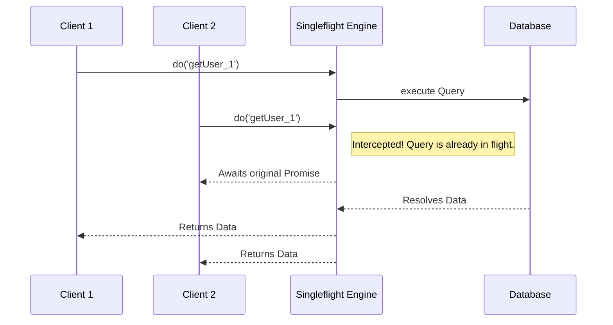

# 🛡️ Systems Resilience (`@node-yalc/resilience`)

## 💡 1. What It Is & Architectural Purpose
The `@node-yalc/resilience` module provides core microservice stability patterns: Circuit Breakers, Token Bucket Rate Limiters, and Singleflight (Promise Coalescing). Its architectural purpose is to protect the application from cascading failures, mitigate heavy load via request throttling, and massively optimize concurrent identical operations to external APIs or databases.

---

## ⚙️ 2. Comprehensive Taxonomy & Key Features

| Pattern | Description | Use Case |
| :--- | :--- | :--- |
| **`CircuitBreaker`** | Fails fast when an external service is degraded. | Wrapping external HTTP calls (e.g. to Stripe or a Legacy DB). If it fails 5 times, it blocks further attempts for 10 seconds. |
| **`RateLimiter`** | Token-bucket throttling. | Limiting users to 100 API requests per minute to prevent DB exhaustion. |
| **`Singleflight`** | Request coalescer. | If 100 concurrent requests ask for the exact same database row, Singleflight executes *one* DB query and shares the Promise with all 100 callers. |

---

## 🔬 3. How It Works Under the Hood

### The Singleflight Coalescing Pattern
Singleflight utilizes an in-flight JavaScript `Map` of Promises.



By deduplicating simultaneous requests for the exact same key, Singleflight provides an astronomical performance boost during cache stampedes, without needing a Redis layer.

---

## 🧠 4. Why It Was Designed This Way (Rationale)

Most Node.js applications solve API failures by indefinitely retrying, and solve heavy load by querying Redis. 
- Infinite retries often trigger "Retry Storms", effectively accidentally DDOSing your own downstream services.
- Redis caching is great, but when a cache key expires, a "Cache Stampede" occurs where 100 requests miss the cache and hit the DB simultaneously.

`@node-yalc/resilience` provides lightweight, in-memory structures that solve these complex distributed systems problems natively in the Node.js process space.

---

## 🚀 5. Practical Usage Guide & Extended Code Examples

### 1. Wrapping External Calls in a Circuit Breaker

```typescript
import { CircuitBreaker } from '@node-yalc/resilience';

// Trip after 3 failures, wait 15 seconds to test recovery
const paymentCircuit = new CircuitBreaker(3, 15000);

export async function processPayment() {
  return await paymentCircuit.execute(
    async () => {
      // Primary Action
      const response = await fetch('https://api.stripe.com/charge');
      if (!response.ok) throw new Error('Stripe Down');
      return response.json();
    },
    () => {
      // Fallback Action (Optional)
      console.warn('Payment system is degraded. Queuing for later.');
      return { status: 'QUEUED' };
    }
  );
}
```

### 2. Defeating Cache Stampedes with Singleflight

```typescript
import { Singleflight } from '@node-yalc/resilience';

const flight = new Singleflight();

export async function getUserProfile(userId: string) {
  // If 500 requests hit this endpoint for the same userId simultaneously,
  // the heavy DB query is only executed exactly ONCE.
  return await flight.do(`userProfile_${userId}`, async () => {
     return await heavyDatabaseQuery(userId);
  });
}
```

---

## ⚠️ 6. Anti-Patterns: How NOT to Use It

> [!CAUTION]
> **Anti-Pattern 1: Scoped Circuit Breakers**
> Do not instantiate `new CircuitBreaker()` inside a function or a web request handler. The circuit state (`CLOSED`, `OPEN`) must be tracked globally. Always instantiate Circuit Breakers and Singleflights as singletons or module-level variables.

> [!WARNING]
> **Anti-Pattern 2: Wrapping fast, local logic in Singleflight**
> Singleflight introduces a tiny closure allocation overhead. Do not wrap local, instantaneous operations (like simple math or `Map` lookups) in `.do()`. Only wrap heavy async I/O tasks.

---

## 💡 7. Pro-Tips & Best Practices

> [!TIP]
> **Pro-Tip: Singleflight + Redis**
> Combine Singleflight with your Redis caching layer! Wrap your Redis `GET` inside a Singleflight. If the key is missing, fetch from DB, save to Redis, and return. This totally eliminates cache stampedes when your highest traffic keys expire.
