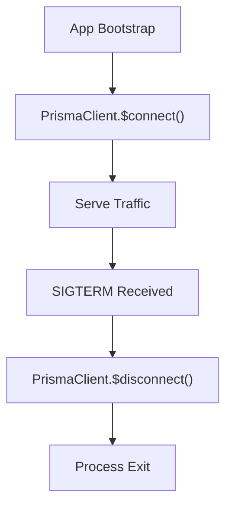

# 💾 Prisma ORM Integration (`@yalc/databases/prisma`)

## 💡 1. What It Is & Architectural Purpose
The `@yalc/databases/prisma` module is a dedicated integration layer connecting the Prisma ORM to the Node-YALC ecosystem. Its primary architectural purpose is to manage database connection lifecycles, handle query logging through standard YALC loggers, and prevent connection exhaustion in highly concurrent microservice environments.

---

## ⚙️ 2. Comprehensive Taxonomy & Key Features

| Component | Description | Use Case |
| :--- | :--- | :--- |
| **`PrismaConnectionManager`** | Lifecycle orchestrator for Prisma Client. | Graceful startup and teardown of DB connections. |
| **`PrismaYalcLogger`** | Bridge between Prisma events and `@yalc/logger`. | Capturing slow queries and DB errors centrally. |
| **`TransactionScope`** | Context-aware transaction manager. | Executing complex sagas across multiple repositories. |

---

## 🔬 3. How It Works Under the Hood

The Connection Manager wraps the Prisma Client and hooks into the Node process lifecycle signals (`SIGTERM`, `SIGINT`). 



This prevents dangling connections that could overwhelm the PostgreSQL/MySQL connection pool when Kubernetes scales pods up or down.

---

## 🧠 4. Why It Was Designed This Way (Rationale)

### Architectural Trade-Off Analysis

Prisma natively connects to the database upon the first query (lazy evaluation). However, in production systems, this lazy connection can cause the first HTTP request to experience massive latency. The `PrismaConnectionManager` forces an eager connection during the application boot phase, ensuring the pod is marked as "Ready" only when the database is truly reachable.

---

## 🚀 5. Usage Guide & Code Examples

### Eager Connection & Graceful Shutdown

```typescript
import { PrismaClient } from '@prisma/client';
import { PrismaConnectionManager } from '@yalc/databases/prisma';

const prisma = new PrismaClient();
const dbManager = new PrismaConnectionManager(prisma);

async function bootstrap() {
  // Eagerly connect before accepting traffic
  await dbManager.connect();
  console.log('Database connected!');
  
  // Register graceful shutdown
  process.on('SIGTERM', async () => {
    console.log('Shutting down gracefully...');
    await dbManager.disconnect();
    process.exit(0);
  });
}

bootstrap();
```

---

## ⚠️ 6. Anti-Patterns: How NOT to Use It

> [!WARNING]
> **Anti-Pattern 1: Multiple Prisma Instances**
> Instantiating multiple `new PrismaClient()` objects will exhaust your database connection pool rapidly. Always treat the Prisma Client as an application-wide singleton and inject it via the IoC container.

---

## 开启 7. Pro-Tips & Best Practices

> [!TIP]
> **Pro-Tip: Connection Pooling with PgBouncer**
> When running hundreds of microservice instances, configure Prisma to connect through PgBouncer by using the `pgbouncer=true` parameter in your database URL. The `PrismaConnectionManager` handles this transparently.
