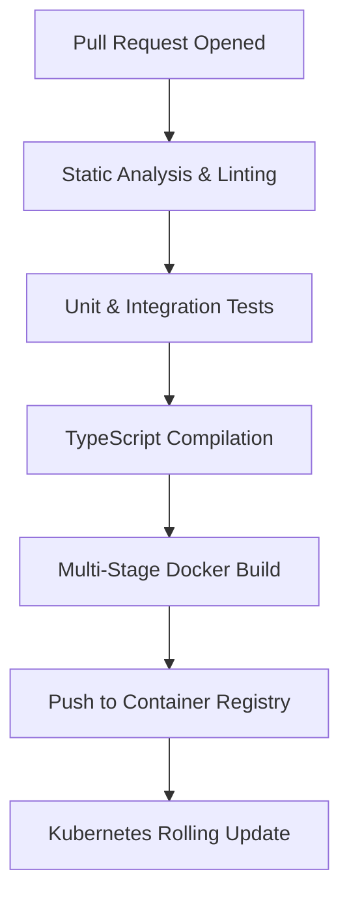

# 🚀 Deployment & CI/CD (`@node-yalc/ci-cd`)

## 💡 1. What It Is & Architectural Purpose

In the Ferrox 7-Layer Architecture, deployment and continuous integration form the foundational infrastructure layer. Node-YALC projects typically run in containerized environments, such as Docker or Kubernetes. This section outlines the standardized enterprise practices for building, testing, and deploying Node-YALC applications safely and predictably.

---

## ⚙️ 2. Comprehensive Taxonomy & Key Features

- **Multi-stage Builds**: Minimizes Docker image size and attack surface by excluding development dependencies from the final image.
- **Automated Quality Gates**: Enforces strict linting, type-checking, and unit testing before any code can be merged.
- **Graceful Shutdown Integration**: Ensures zero-downtime deployments by coordinating with Kubernetes SIGTERM signals.

---

## 🔬 3. How It Works Under the Hood

The CI/CD pipeline operates in three distinct phases: Build, Test, and Package.



---

## 🧠 4. Why It Was Designed This Way (Rationale)

Deploying Node.js applications at an enterprise scale requires strict dependency management. By using multi-stage Docker builds, we guarantee that the production image contains only the compiled JavaScript and the absolutely necessary runtime dependencies (`node_modules` installed with `npm ci --omit=dev`). This reduces the image footprint by over 70%, improving startup times and reducing vulnerabilities.

---

## 🚀 5. Practical Usage Guide & Extended Code Examples

### Standard Dockerfile

```dockerfile
# Stage 1: Build
FROM node:20-alpine AS builder
WORKDIR /app
COPY package*.json ./
# Install all dependencies including devDependencies for compilation
RUN npm ci
COPY . .
RUN npm run build

# Stage 2: Production Runtime
FROM node:20-alpine
WORKDIR /app
# Copy only the compiled dist and production node_modules
COPY --from=builder /app/dist ./dist
COPY --from=builder /app/node_modules ./node_modules
# Execute the application
CMD ["node", "dist/main.js"]
```

---

## ⚠️ 6. Anti-Patterns: How NOT to Use It

> [!CAUTION]
> **Anti-Pattern 1: Running npm install in Production Image**
> Never execute `npm install` dynamically inside the final production container stage. It introduces non-deterministic behavior and bloats the image with unnecessary caching artifacts.

---

## 💡 7. Pro-Tips & Best Practices

> [!TIP]
> **Pro-Tip 1: Connect with Node-YALC Primitives**
> Ensure your CI/CD pipelines inject the correct environment variables mapped in the `[@node-yalc/common](../fundamentals/common.md)` package, specifically the `NODE_ENV` enumeration.
