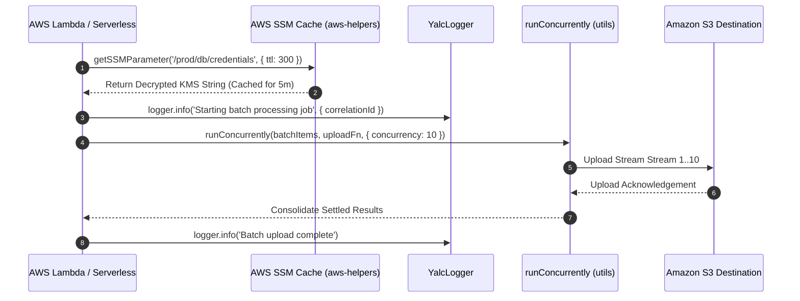

# Introduction & Node-Yalc Workspace Architecture

Welcome to **Node-YALC** (*Node.js Yet Another Layer of Convenience*), the foundational low-level package workspace providing non-framework-specific primitives, AWS serverless helpers, high-performance Pino loggers, standardized exception taxonomies, event buses, and utility routines for modern Node.js and TypeScript ecosystems.

---

## 1. What It Is & Architectural Purpose

While `@nestjs-yalc` caters specifically to NestJS framework abstractions, enterprise architectures often consist of heterogeneous components: raw Fastify servers, Express gateways, AWS Lambda serverless functions, background CLI workers, and standalone scripts.

**Node-YALC** delivers pure JavaScript/TypeScript operational building blocks that operate independently of any web framework. It provides identical logging formats, error taxonomy, AWS SSM parameter caching, and concurrency workers across both serverless edge functions and monolithic Node.js containers.

```
┌────────────────────────────────────────────────────────────────────────────────────────┐
│                              NODE-YALC MONOREPO WORKSPACE                              │
├────────────────────────────────────────────────────────────────────────────────────────┤
│  @node-yalc/logger  │  @node-yalc/errors  │  @node-yalc/aws-helpers  │  @node-yalc/utils │
├─────────────────────┴─────────────────────┴──────────────────────────┴──────────────────┤
│  @node-yalc/interfaces  │  @node-yalc/types  │  @node-yalc/types-extends  │  @node-yalc/common│
└────────────────────────────────────────────────────────────────────────────────────────┘
```

---

## 2. Workspace Package Taxonomy

| Package | Purpose & Functionality | Key Primitives |
| :--- | :--- | :--- |
| **`@node-yalc/logger`** | Structured JSON Logging | High-speed Pino logger, correlation ID bindings, redact rules. |
| **`@node-yalc/errors`** | System Error Taxonomy | Base error classes (`AppError`, `NotFoundException`, `SystemError`). |
| **`@node-yalc/aws-helpers`**| AWS Cloud Automation | SSM parameter decryption, S3 streaming uploads, Lambda adapters. |
| **`@node-yalc/event-manager`**| Event Bus Architecture | In-process EventEmitter2 bus with wildcard subscriptions. |
| **`@node-yalc/utils`** | Async Queue & Object Tools | `runConcurrently()` queue, deep cloning, object sanitizers. |
| **`@node-yalc/common`** | Enums & Value Objects | System environment flags (`AppEnvEnum`), ISO currency & headers. |
| **`@node-yalc/interfaces`**| Shared Data Contracts | `IServiceResponse<T>`, `IEventEnvelope<T>`, `IPaginatedResponse<T>`. |
| **`@node-yalc/types`** | Advanced Type Generics | `DeepPartial<T>`, `Nullable<T>`, type-narrowing guard functions. |
| **`@node-yalc/types-extends`**| Global Module Augmentation| Express/Fastify request property typing (`req.user`, `req.correlationId`). |

---

## 3. Core Architectural Philosophy

### 1. Framework Agnostic
Zero tight coupling to NestJS, Express, or Fastify. Libraries can be imported directly into AWS Lambda, Next.js, or plain Node.js scripts.

### 2. Zero-Copy High Performance
Powered by ultra-fast JSON serializers (Fast-Json-Stringify) and low-allocation memory structures to handle thousands of requests per second.

### 3. Pure TypeScript Integrity
Complete type inference for every single helper. Strict compiler flags enabled with zero implicit `any` fallbacks.

---

## 4. Execution Sequence Flow



---

## 5. Next Steps

- Proceed to the [Quickstart Guide](quickstart.md) to integrate `@node-yalc` into your Node.js application.
- Browse detailed package documentation in the **Workspace Packages** sidebar section.
