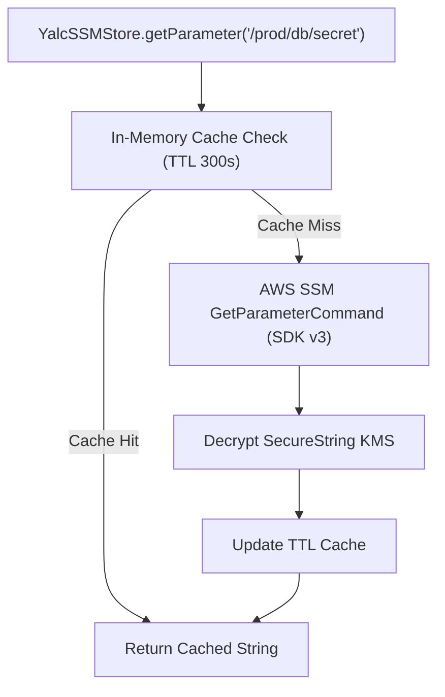

# ☁️ AWS SDK v3 Utilities (`@node-yalc/aws-helpers`)

## 💡 1. What It Is & Architectural Purpose
`@node-yalc/aws-helpers` provides high-performance, modular wrappers around the official **AWS SDK v3 for JavaScript/TypeScript**. Its architectural purpose is to streamline interaction with AWS cloud services—such as **Amazon S3**, **AWS SSM Parameter Store**, and **AWS Lambda**—while providing native retry policies, exponential backoff, secret masking, and zero framework lock-in.

---

## ⚙️ 2. What It Does & Key Features
- **S3 Bucket Operations (`YalcS3Client`)**: Streaming file uploads, signed URL generation, and multipart transfer orchestration.
- **SSM Parameter Store Client (`YalcSSMStore`)**: Secure parameter fetching with automatic in-memory TTL caching and decryption of `SecureString` parameters.
- **Lambda Event Adapters**: Normalization of API Gateway v1/v2 and Application Load Balancer (ALB) event objects.

---

## 🔬 3. How It Works Under the Hood



---

## 🧠 4. Why It Was Designed This Way (Modular SDK v3 vs Legacy SDK v2)

| Aspect | ☁️ `@node-yalc/aws-helpers` (SDK v3) | 🐢 Legacy AWS SDK v2 |
|---|---|---|
| **Bundle Footprint** | **Tree-shakeable (Imports only required clients)** | Monolithic ~15MB SDK Bundle |
| **Secret Protection** | **In-Memory Encrypted TTL Caching** | Raw Uncached SSM Calls |
| **Retry & Backoff** | **Exponential Backoff with Full Jitter** | Basic Retries |

---

## 🚀 5. Practical Usage Guide & Extended Code Examples

```typescript
import { YalcS3Client, YalcSSMStore } from '@node-yalc/aws-helpers';

async function executeCloudOperations() {
  // 1. Fetch Secure Database Password from AWS SSM Parameter Store with 5-minute caching
  const dbPassword = await YalcSSMStore.getParameter('/prod/database/password', {
    decrypt: true,
    cacheTtlSeconds: 300
  });

  console.log('Successfully retrieved SSM parameter (Masked):', dbPassword.substring(0, 3) + '***');

  // 2. Upload Document Buffer to Amazon S3
  const s3 = new YalcS3Client({ region: 'eu-west-1' });
  const fileBuffer = Buffer.from('PDF Report Content');

  const uploadResult = await s3.uploadFile({
    bucket: 'acme-enterprise-reports',
    key: '2026/quarterly_report.pdf',
    body: fileBuffer,
    contentType: 'application/pdf'
  });

  console.log('S3 Upload Successful. File ETag:', uploadResult.ETag);
}

executeCloudOperations().catch(console.error);
```

---

## ⚠️ 6. Anti-Patterns: How NOT to Use It

1. ❌ **DO NOT fetch SSM parameters on every HTTP request without caching**: Making uncached AWS SSM API calls inside high-frequency request paths will hit AWS API Rate Limits (ThrottlingException). Always use `cacheTtlSeconds`.

---

## 💡 7. Pro-Tips & Best Practices

> [!TIP]
> **AWS IAM Role Authentication**: Omit explicit AWS credentials in client initializations when deploying to AWS ECS, EKS, or Lambda—the helper automatically assumes the IAM Instance Role.
