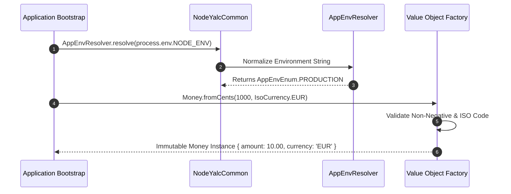

# Common Core Constants, Enumerations & Value Objects

The `@node-yalc/common` package provides enterprise-wide value objects, system constants, execution environment enumerations, HTTP status code maps, and shared microservice metadata contracts used across the entire YALC suite.

---

## 1. What It Is & Architectural Purpose

In microservice monorepos, shared primitives like environment flags (`NODE_ENV`), currency codes, execution status strings, standard date formats, and HTTP header names often end up hardcoded across multiple repositories. This duplication causes inconsistencies—such as one service expecting `"prod"` while another checks `"production"`.

`@node-yalc/common` centralizes these foundational constants and value objects into a single, zero-dependency package. It guarantees absolute consistency across backend Node.js microservices, NestJS applications, CLI tools, and serverless Lambda functions.

```
┌────────────────────────────────────────────────────────────────────────┐
│                          @node-yalc/common                             │
├────────────────────────────────────────────────────────────────────────┤
│  • System Environment Enums (AppEnv, NodeEnv)                         │
│  • Standard HttpHeaders & HttpMethod Maps                              │
│  • Value Objects (Money, Currency, IsoLanguage)                       │
│  • Monorepo Namespace Constants                                        │
└──────────────────────────────────┬─────────────────────────────────────┘
                                   │ Shared Primitives
            ┌──────────────────────┼──────────────────────┐
            ▼                      ▼                      ▼
┌──────────────────────┐┌──────────────────────┐┌──────────────────────┐
│ @node-yalc/logger    ││ @node-yalc/errors    ││ @node-yalc/utils     │
└──────────────────────┘└──────────────────────┘└──────────────────────┘
```

---

## 2. What It Does & Key Capabilities

- **`AppEnvEnum` & `NodeEnvEnum`**: Type-safe enumerations (`LOCAL`, `DEVELOPMENT`, `STAGING`, `PRODUCTION`, `TEST`) with environment validation helpers.
- **`HttpHeaders` & `HttpMediaTypes`**: Standardized string constants for HTTP headers (`X-Correlation-Id`, `X-Request-Id`, `Authorization`, `Content-Type`).
- **`IsoCurrency` & `IsoLanguage`**: Strictly typed ISO-4217 currency symbols (`USD`, `EUR`, `GBP`) and ISO-639-1 language codes.
- **Value Objects**: Immutable TypeScript classes representing domain concepts like `EmailAddress`, `UUID`, and `Money`.

---

## 3. How It Works Under the Hood

### Environment Validation & Value Object Resolution



---

## 4. Why It Was Designed This Way

| Metric | Loose String Literals | @node-yalc/common Primitives |
| :--- | :--- | :--- |
| **Typo Risk** | High (`"produciton"`, `"x-correlation-ID"`). | Zero. Enforced at compile time via TypeScript Enums. |
| **Refactoring** | Manual search-and-replace across 50+ repositories. | IDE symbol rename propagates instantly across monorepo. |
| **Memory Footprint**| Garbage collection thrashing on string re-allocations. | Frozen, immutably cached singleton constants. |

---

## 5. Practical Usage Guide & Extended Code Examples

### 5.1 Environment Check & Header Binding

```typescript
import { AppEnvEnum, HttpHeaders, isProduction } from '@node-yalc/common';

export function setupSecurityHeaders(env: string, headers: Record<string, string>) {
  if (isProduction(env)) {
    headers[HttpHeaders.STRICT_TRANSPORT_SECURITY] = 'max-age=31536000; includeSubDomains';
  }

  headers[HttpHeaders.X_CORRELATION_ID] = 'corr_' + Date.now();
}
```

### 5.2 Type-Safe Money Value Object

```typescript
import { Money, IsoCurrency } from '@node-yalc/common';

const price = Money.fromDecimal(49.99, IsoCurrency.USD);
const tax = price.multiply(0.20); // 20% VAT
const total = price.add(tax);

console.log(total.format()); // "$59.99"
console.log(total.toCents()); // 5999
```

---

## 6. Anti-Patterns: How NOT to Use It

> [!CAUTION]
> **Anti-Pattern 1: Hardcoding Environment Strings**
> Never compare `process.env.NODE_ENV === 'prod'`. Always use `AppEnvResolver.isProduction()` to handle alias variants (`prod`, `production`).

---

## 7. Pro-Tips & Best Practices

> [!TIP]
> **Pro-Tip 1: Centralized Constant Export**
> Import headers directly from `HttpHeaders` constant maps to maintain parity across frontend web clients, Node.js API gateways, and serverless functions.
