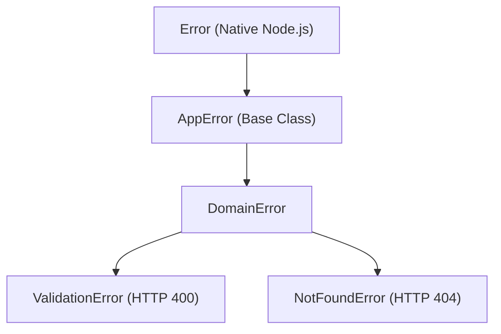

# ⚠️ Safe Application Error Hierarchy (`@node-yalc/errors`)

## 💡 1. What It Is & Architectural Purpose
`@node-yalc/errors` defines the strongly-typed exception hierarchy used across the ecosystem. It was designed to ensure that domain and system exceptions are caught, serialized, and returned to clients **without exposing stack traces or internal database details in production environments**.

---

## ⚙️ 2. What It Does & Key Features
- **Base `AppError`**: Base extensible exception class for all application errors with HTTP status codes and detailed payloads.
- **Domain Specific Exceptions**: `NotFoundError`, `ValidationError`, `UnauthorizedError`, `ForbiddenError`, `ConflictError`, `BadGatewayError`.
- **Stack Trace Leak Prevention**: Automatically masks inner error details when running in `production` mode.
- **Normalized JSON Serialization**: Provides standardized `.toJSON()` representations for HTTP/GraphQL responses.

---

## 🔬 3. How It Works Under the Hood



1. **Status Code Binding**: Each exception defines a `statusCode` property (e.g., 404 for `NotFoundError`, 400 for `ValidationError`).
2. **Context Payload Attachment**: Attach strongly-typed metadata payloads for tracing (e.g., `{ entity: 'User', id: 'usr-123' }`).

---

## 🧠 4. Why It Was Designed This Way (Standardized Hierarchy)

| Aspect | ⚠️ `@node-yalc/errors` | ❌ Plain `throw new Error()` |
|---|---|---|
| **Exception Type** | Strongly-Typed with Metadata Payload | Untyped String |
| **HTTP Status Code** | Mapped Automatically | Requires manual `if/else` in Middleware |
| **Production Safety** | Stack Trace Masked in Production | Risk of SQL Query or Path Leaks |

---

## 🚀 5. Practical Usage Guide & Extended Code Examples

```typescript
import { NotFoundError, ValidationError } from '@node-yalc/errors';

export function getUserProfile(userId: string) {
  if (!userId) {
    throw new ValidationError('The userId parameter is required', [
      { field: 'userId', issue: 'Missing required string parameter' }
    ]);
  }

  const user = null; // Simulation
  if (!user) {
    throw new NotFoundError(`Unable to find user with ID ${userId}`, {
      entity: 'User',
      requestedId: userId
    });
  }

  return user;
}

try {
  getUserProfile('');
} catch (err: any) {
  if (err instanceof ValidationError) {
    console.log('Validation Error HTTP Code:', err.statusCode); // 400
    console.log('Details:', err.errors);
  }
}
```

---

## ⚠️ 6. Anti-Patterns: How NOT to Use It

1. ❌ **DO NOT swallow errors in empty `try/catch` blocks**: Catching exceptions without rethrowing or logging prevents security filters and telemetry from tracking failures.
2. ❌ **DO NOT return raw database error messages to users**: Rethrowing raw MySQL/Postgres driver errors (`ER_DUP_ENTRY`) exposes schema internals to attackers.

---

## 💡 7. Pro-Tips & Best Practices

> [!TIP]
> **Exception Filters Integration**: `@node-yalc/errors` integrates natively with `nestjs-yalc` and Ferrox-Node Exception Filters, converting exceptions directly into RFC 7807 compliant Problem Details JSON responses.
