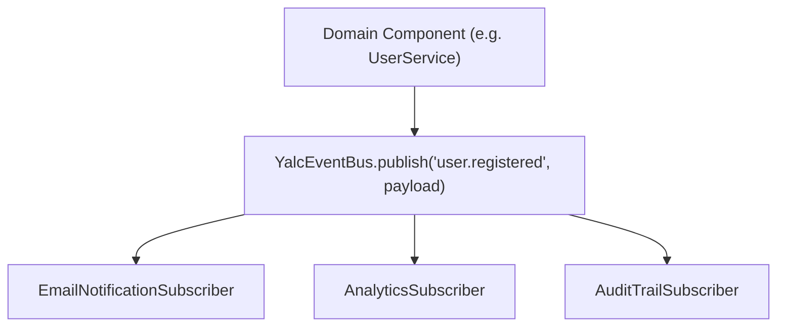

# 📡 Typed Event Bus & Publisher (`@node-yalc/event-manager`)

`@node-yalc/event-manager` provides a strongly-typed in-memory and distributed event bus for TypeScript applications. It allows domain components to publish and subscribe to domain events without direct coupling.

---

## 🌟 Key Features

- **Type-Safe Payloads**: Guarantees compile-time type safety for event names and payload structures.
- **Async Subscriber Execution**: Executes subscriber callbacks asynchronously without blocking publisher execution.
- **Wildcard Subscriptions**: Supports wildcard event pattern subscriptions (e.g. `user.*`).
- **Error Isolation**: Prevents a failing event subscriber from crashing other subscribers or rolling back the publisher's execution.

---

## 🔬 Internal Architecture & Execution Mechanics



---

## 📊 Architectural Comparison: `@node-yalc/event-manager` vs Native EventEmitter

| Feature / Dimension | 📡 `@node-yalc/event-manager` | 🐢 Native Node.js `EventEmitter` |
|---|---|---|
| **Type Safety** | **Strongly-Typed Event Map** | Untyped Strings & `any` Payloads |
| **Subscriber Error Isolation** | **Isolated (Subscriber errors isolated)** | Unhandled Error crashes Process |
| **Async Support** | **Native Async / Promise Support** | Synchronous Fire-and-Forget |

---

## 🚀 Practical Usage & Production Code Examples

```typescript
import { YalcEventBus } from '@node-yalc/event-manager';

interface AppEvents {
  'user.created': { id: string; email: string; createdAt: Date };
  'order.completed': { orderId: string; totalAmount: number };
}

const eventBus = new YalcEventBus<AppEvents>();

// 1. Register Typed Subscriber
eventBus.subscribe('user.created', async (payload) => {
  console.log(`Sending welcome email to ${payload.email} (ID: ${payload.id})`);
});

// 2. Publish Typed Event
await eventBus.publish('user.created', {
  id: 'usr-99120',
  email: 'mario@ferrox.dev',
  createdAt: new Date(),
});
```

---

## ⚠️ Common Pitfalls & Anti-Patterns

> [!CAUTION]
> **Using Event Bus for Synchronous Data Retrieval**: Event buses are strictly intended for side-effects and asynchronous domain events. Do not use an event bus to query data that is immediately required in the same request handler.

---

## 💡 Best Practices

> [!TIP]
> **Domain Event Immutability**: Always freeze domain event payload objects before publishing (`Object.freeze(payload)`) to guarantee that subscribers cannot mutate the payload received by peer subscribers.
