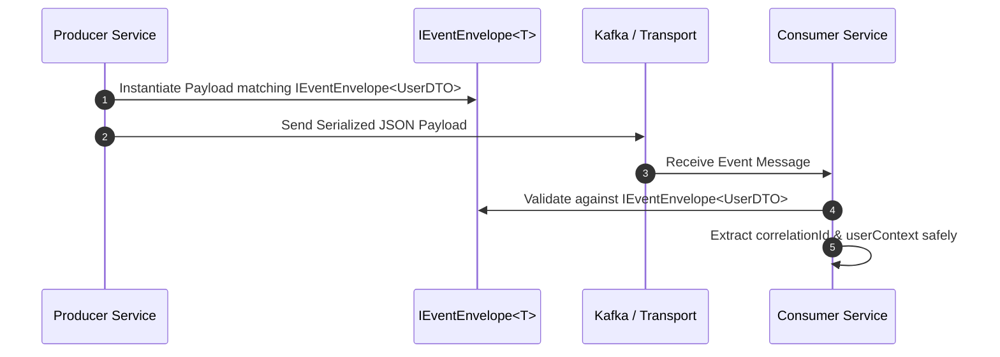

# Core Interfaces, Generic DTO Contracts & Envelopes

The `@node-yalc/interfaces` package defines the contract interfaces, generic pagination containers, event envelope structures, logger definitions, and API transport schemas shared across all Node.js and TypeScript services.

---

## 1. What It Is & Architectural Purpose

Interface segregation is a fundamental principle of clean architecture. When microservices communicate across HTTP REST, GraphQL, or Kafka message brokers, they must share strongly typed data shapes (DTOs, error objects, user context payloads) without incurring code execution overhead or introducing circular dependencies.

`@node-yalc/interfaces` provides a pure TypeScript type definition layer (zero JavaScript output at runtime). It serves as the single source of truth for all data transfer object contracts across the YALC ecosystem.

```
┌────────────────────────────────────────────────────────────────────────┐
│                        @node-yalc/interfaces                           │
├────────────────────────────────────────────────────────────────────────┤
│  • IServiceResponse<T> & IPaginatedResponse<T>                         │
│  • IEventEnvelope<T> & IEventHeaders                                   │
│  • IRequestContext & IUserPayload                                      │
│  • ILoggerOptions & ILogEntry                                          │
└──────────────────────────────────┬─────────────────────────────────────┘
                                   │ Pure TS Interfaces (Zero Bundle Size)
            ┌──────────────────────┼──────────────────────┐
            ▼                      ▼                      ▼
┌──────────────────────┐┌──────────────────────┐┌──────────────────────┐
│ NestJS Microservices ││ Serverless Lambdas   ││ React Web Clients    │
└──────────────────────┘└──────────────────────┘└──────────────────────┘
```

---

## 2. What It Does & Key Capabilities

- **`IServiceResponse<T>`**: Standard response envelope interface containing `statusCode`, `success`, `data`, `errors`, and `timestamp`.
- **`IPaginatedResponse<T>`**: Standardized pagination structure featuring `items`, `total`, `page`, `limit`, `totalPages`, `hasNextPage`, `hasPreviousPage`.
- **`IEventEnvelope<T>`**: Generic CloudEvents-compliant message format for Kafka/RabbitMQ events containing `eventId`, `eventType`, `correlationId`, `timestamp`, and `data`.
- **`IRequestContext`**: Ambient user identity contract containing `userId`, `tenantId`, `roles`, `ipAddress`, and `correlationId`.

---

## 3. How It Works Under the Hood

### Data Contract Flow across Microservices



---

## 4. Why It Was Designed This Way

| Feature | Duplicate Local Interfaces | @node-yalc/interfaces Package |
| :--- | :--- | :--- |
| **Drift Risk** | High. Changes in API payload break client code silently. | Zero drift. Compiler catches breaking property changes immediately. |
| **Runtime Overhead**| Imports include bloated JS helper classes. | 0 KB runtime overhead. Completely stripped during TS compilation. |
| **Cross-Platform** | Tied to Node.js backend modules. | Reusable in Node.js, Web Browsers, React Native, and Edge Workers. |

---

## 5. Practical Usage Guide & Extended Code Examples

### 5.1 Implementing Standard Service Response Envelope

```typescript
import { IServiceResponse, IPaginatedResponse } from '@node-yalc/interfaces';

export interface UserDto {
  id: string;
  email: string;
  role: string;
}

export async function fetchUsersList(
  page: number,
  limit: number,
): Promise<IServiceResponse<IPaginatedResponse<UserDto>>> {
  const users: UserDto[] = [
    { id: '1', email: 'admin@example.com', role: 'ADMIN' },
  ];

  return {
    statusCode: 200,
    success: true,
    data: {
      items: users,
      total: 1,
      page,
      limit,
      totalPages: 1,
      hasNextPage: false,
      hasPreviousPage: false,
    },
    timestamp: new Date().toISOString(),
  };
}
```

### 5.2 CloudEvents Event Envelope Signature

```typescript
import { IEventEnvelope } from '@node-yalc/interfaces';

export interface UserRegisteredPayload {
  userId: string;
  email: string;
}

export function createRegistrationEvent(
  payload: UserRegisteredPayload,
  correlationId: string,
): IEventEnvelope<UserRegisteredPayload> {
  return {
    eventId: 'evt_' + Math.random().toString(36).substring(2, 9),
    eventType: 'user.registered.v1',
    correlationId,
    source: 'user-service',
    timestamp: new Date().toISOString(),
    data: payload,
  };
}
```

---

## 6. Anti-Patterns: How NOT to Use It

> [!CAUTION]
> **Anti-Pattern 1: Adding Executable Code to Interfaces Package**
> Never place concrete JavaScript classes or executable functions inside `@node-yalc/interfaces`. It must remain a pure interface/type declaration package.

---

## 7. Pro-Tips & Best Practices

> [!TIP]
> **Pro-Tip 1: Re-exporting from Shared Libraries**
> Re-export `@node-yalc/interfaces` from your monorepo's shared SDKs to ensure frontend clients share identical response types.
