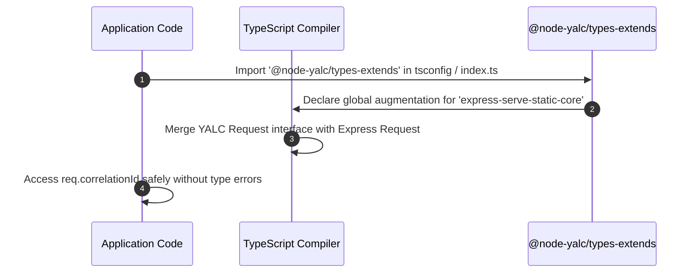

# Extended Type Definitions, Mixins & Meta-Type Extensions

The `@node-yalc/types-extends` package provides module augmentation, third-party global type extensions (for Express `Request`, Fastify `FastifyRequest`, TypeORM `SelectQueryBuilder`, and Pino `Logger`), and class mixin helpers for TypeScript applications.

---

## 1. What It Is & Architectural Purpose

Node.js microservices heavily rely on third-party frameworks (Express, Fastify, TypeORM, Pino, KafkaJS). However, attaching custom context variables—such as `req.user`, `req.correlationId`, `req.tenantId`, or custom TypeORM query builder methods—causes TypeScript compilation errors unless global module declarations are augmented properly.

`@node-yalc/types-extends` centralizes these global module ambient declarations and class mixins. It seamlessly injects YALC metadata into standard framework types across the entire workspace.

```
┌────────────────────────────────────────────────────────────────────────┐
│                        @node-yalc/types-extends                        │
├────────────────────────────────────────────────────────────────────────┤
│  • Ambient Module Declarations (Express / Fastify / TypeORM / Pino)    │
│  • Mixin Type Utilities (Constructor<T>, ClassType<T>)                 │
│  • Express Request Augmentation (req.correlationId, req.user)          │
│  • TypeORM SelectQueryBuilder Extension Methods                        │
└──────────────────────────────────┬─────────────────────────────────────┘
                                   │ Global Module Augmentation
            ┌──────────────────────┼──────────────────────┐
            ▼                      ▼                      ▼
┌──────────────────────┐┌──────────────────────┐┌──────────────────────┐
│ Express Request      ││ Fastify Request      ││ TypeORM QueryBuilder │
└──────────────────────┘└──────────────────────┘└──────────────────────┘
```

---

## 2. What It Does & Key Capabilities

- **Global Express & Fastify Request Augmentation**: Automatically types `req.user`, `req.correlationId`, `req.tenantId`, and `req.logger` across all HTTP handlers.
- **`Constructor<T>` & `ClassType<T>`**: Standardized mixin generics for dynamic class creation and decorator composition.
- **TypeORM QueryBuilder Augmentation**: Adds custom utility method signatures (`.paginate()`, `.applyFilters()`) to TypeORM's `SelectQueryBuilder`.
- **Pino Child Logger Types**: Augments Pino's `Logger` interface to enforce correlation ID context bindings.

---

## 3. How It Works Under the Hood

### TypeScript Ambient Module Augmentation Mechanics



---

## 4. Why It Was Designed This Way

| Feature | Fragmented Ambient Files (`index.d.ts`) | @node-yalc/types-extends Package |
| :--- | :--- | :--- |
| **Consistency** | Duplicate `declare module` statements across 20+ packages. | Single import augments type definitions globally across monorepo. |
| **Safety** | Risky `req['correlationId'] as string` unsafe indexing. | Auto-completed `req.correlationId` with strong string typing. |
| **Mixins** | Broken class inheritance when extending dynamic classes. | Strongly typed `Constructor<T>` mixin factories. |

---

## 5. Practical Usage Guide & Extended Code Examples

### 5.1 Utilizing Augmented Express / Fastify Request Properties

```typescript
import '@node-yalc/types-extends';
import { Request, Response } from 'express';

export function correlationMiddleware(req: Request, res: Response, next: () => void) {
  // Property 'correlationId' is automatically typed on Express Request
  req.correlationId = (req.headers['x-correlation-id'] as string) || 'corr_' + Date.now();

  // Property 'user' is automatically typed with IUserPayload interface
  req.user = {
    userId: 'usr_999',
    tenantId: 'tenant_az',
    roles: ['ADMIN'],
  };

  next();
}
```

### 5.2 Building Dynamic Class Mixins with `Constructor<T>`

```typescript
import { Constructor } from '@node-yalc/types-extends';

// Mixin function that adds timestamp tracking to any base class
export function WithTimestamps<TBase extends Constructor>(Base: TBase) {
  return class extends Base {
    createdAt: Date = new Date();
    updatedAt: Date = new Date();

    touch() {
      this.updatedAt = new Date();
    }
  };
}

class BaseEntity {
  id: string = '123';
}

const TimestampedEntity = WithTimestamps(BaseEntity);
const entity = new TimestampedEntity();
console.log(entity.id); // "123"
console.log(entity.createdAt); // Date instance
```

---

## 6. Anti-Patterns: How NOT to Use It

> [!CAUTION]
> **Anti-Pattern 1: Redeclaring Express Module Augmentation Locally**
> Avoid adding local `declare global { namespace Express { ... } }` in individual app repositories. This creates ambient declaration conflicts with `@node-yalc/types-extends`.

---

## 7. Pro-Tips & Best Practices

> [!TIP]
> **Pro-Tip 1: tsconfig Include Binding**
> Include `@node-yalc/types-extends` directly in your root `tsconfig.json` `types` array to ensure global augmentations apply everywhere without manual imports.
