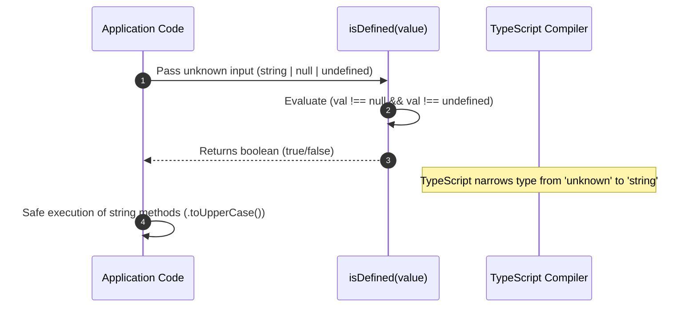

# Type Primitives, Utility Types & Type Guards

The `@node-yalc/types` package provides core TypeScript primitive types, advanced conditional utility types (`DeepPartial`, `Nullable`, `KeysMatching`), type guards, and compile-time type validation primitives.

---

## 1. What It Is & Architectural Purpose

TypeScript's built-in utility types (`Partial<T>`, `Required<T>`, `Pick<T, K>`) are essential for everyday development, but they fail when handling deeply nested domain models, conditional object mapping, or validating non-nullable runtime structures.

`@node-yalc/types` extends TypeScript's type system with enterprise-grade utility type generics and custom type guards. It enables developers to write strictly typed code without falling back to loose `any` casting or `as unknown as T` workarounds.

```
┌────────────────────────────────────────────────────────────────────────┐
│                          @node-yalc/types                              │
├────────────────────────────────────────────────────────────────────────┤
│  • DeepPartial<T>, DeepRequired<T>, DeepReadonly<T>                    │
│  • Nullable<T>, Maybe<T>, Optional<T>                                  │
│  • KeysMatching<T, Type>, PropertyPath<T>                              │
│  • IsDefined(), IsNonEmptyString(), IsObject() Type Guards             │
└──────────────────────────────────┬─────────────────────────────────────┘
                                   │
                                   ▼
┌────────────────────────────────────────────────────────────────────────┐
│                   Type-Safe Application Codebase                       │
└────────────────────────────────────────────────────────────────────────┘
```

---

## 2. What It Does & Key Capabilities

- **`DeepPartial<T>`**: Recursively makes all properties (and nested object/array properties) of `T` optional.
- **`Nullable<T>` & `Maybe<T>`**: Standardized type alias wrappers for `T | null` and `T | null | undefined`.
- **`KeysMatching<T, V>`**: Extracts property keys from `T` whose values match type `V` (e.g., extracting all `string` keys).
- **Runtime Type Guards**: Type-narrowing guard functions (`isDefined()`, `isString()`, `isObject()`, `isPromise()`).

---

## 3. How It Works Under the Hood

### Type Narrowing & Guard Mechanics



---

## 4. Why It Was Designed This Way

| Metric | Built-in Partial<T> | DeepPartial<T> from @node-yalc/types |
| :--- | :--- | :--- |
| **Nested Objects** | Only makes top-level properties optional. | Recursively makes all sub-objects and arrays optional. |
| **Type Safety** | Requires manual casting for deep patch updates. | Automatic recursive type inference. |
| **Runtime Guards** | Standard `typeof` checks miss `null` objects (`typeof null === 'object'`). | `isObject()` correctly excludes `null` and `Array`. |

---

## 5. Practical Usage Guide & Extended Code Examples

### 5.1 Deep Partial DTO Updating

```typescript
import { DeepPartial, Nullable } from '@node-yalc/types';

export interface UserProfile {
  id: string;
  contact: {
    email: string;
    phone: Nullable<string>;
    address: {
      street: string;
      city: string;
    };
  };
}

// Allows updating deeply nested properties safely without providing full objects
export function updateProfile(
  existing: UserProfile,
  changes: DeepPartial<UserProfile>,
): UserProfile {
  return {
    ...existing,
    contact: {
      ...existing.contact,
      ...changes.contact,
      address: {
        ...existing.contact?.address,
        ...changes.contact?.address,
      },
    },
  };
}
```

### 5.2 Using Runtime Type Guards

```typescript
import { isDefined, isNonEmptyString, isObject } from '@node-yalc/types';

export function processInput(input: unknown): string {
  if (!isDefined(input)) {
    throw new Error('Input is null or undefined');
  }

  if (isNonEmptyString(input)) {
    return input.trim();
  }

  if (isObject(input) && 'name' in input && isNonEmptyString(input.name)) {
    return input.name;
  }

  return 'default_value';
}
```

---

## 6. Anti-Patterns: How NOT to Use It

> [!CAUTION]
> **Anti-Pattern 1: Loose Type Casting**
> Never use `(value as any)` when type guard functions like `isDefined()` or `isObject()` can safely narrow the type at compile time and runtime.

---

## 7. Pro-Tips & Best Practices

> [!TIP]
> **Pro-Tip 1: Filtering Arrays safely**
> Use `isDefined` with Array.filter() to narrow `(T | null)[]` to `T[]` without losing type safety:
> `const validItems = items.filter(isDefined);`
