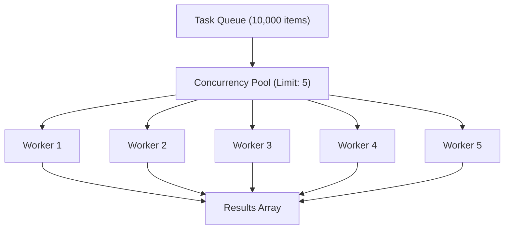

# 🛠️ Core Utilities & Concurrency Control (`@node-yalc/utils`)

## 💡 1. What It Is & Architectural Purpose
`@node-yalc/utils` is the high-performance utility and concurrency execution library of `@node-yalc`. It was designed to provide memory-efficient **object mapping**, **concurrency-limited task runners (`runConcurrently`)**, **deep object sanitization**, and **serialization helpers** without introducing heavy third-party utility dependencies like `lodash` or `async`.

---

## ⚙️ 2. What It Does & Key Features
- **Concurrency Execution Runner (`runConcurrently`)**: Bounded asynchronous task runner preventing Event Loop queue overload.
- **Deep Object Sanitization (`sanitizeObject`)**: Strips `undefined`, `null`, or sensitive keys recursively from data objects.
- **Deep Clone & Merge**: Memory-optimized object cloning and merging.

---

## 🔬 3. How It Works Under the Hood



1. **`runConcurrently` Engine**: Uses an internal queue worker pool. When a task resolves, the worker immediately pulls the next item from the input array, ensuring that no more than $N$ promises run concurrently.

---

## 🧠 4. Why It Was Designed This Way (Controlled Concurrency vs Promise.all)

| Metric / Scenario | 🛠️ `runConcurrently` (Limit: 10) | ❌ `Promise.all(...)` |
|---|---|---|
| **Memory Allocation** | **Bounded Memory Pool** | Unbounded Memory Spike (10k Promises created at once) |
| **Database Connection Pool** | **Prevents Pool Exhaustion** | Crashes Connection Pool with `ECONNRESET` |
| **Error Handling** | **Configurable (Fail-Fast or Settle All)** | Rejects immediately on first error |

---

## 🚀 5. Practical Usage Guide & Extended Code Examples

```typescript
import { runConcurrently, sanitizeObject } from '@node-yalc/utils';

async function processUserQueue() {
  const userIds = Array.from({ length: 500 }, (_, i) => `usr_${i + 1}`);

  // Process 500 items with a maximum concurrency limit of 5 parallel workers
  const results = await runConcurrently(userIds, async (id) => {
    return await fetchExternalAPIData(id);
  }, { concurrency: 5 });

  console.log(`Processed ${results.length} user records successfully.`);

  // Deep sanitize an object to remove undefined values
  const rawPayload = { name: 'Alice', age: undefined, role: null };
  const cleanPayload = sanitizeObject(rawPayload, { removeUndefined: true });
  console.log('Sanitized Payload:', cleanPayload); // { name: 'Alice', role: null }
}

processUserQueue().catch(console.error);
```

---

## ⚠️ 6. Anti-Patterns: How NOT to Use It

1. ❌ **DO NOT use `Promise.all()` over thousands of database queries or API calls**: Running `Promise.all()` over large arrays consumes all available database connection pool slots and leads to socket timeouts. Always use `runConcurrently`.

---

## 💡 7. Pro-Tips & Best Practices

> [!TIP]
> **Database Pool Sizing**: Set `concurrency` to match your database connection pool size (e.g. `concurrency: 10` for a Postgres connection pool of 10 connections) to maximize I/O throughput without queue wait times.
