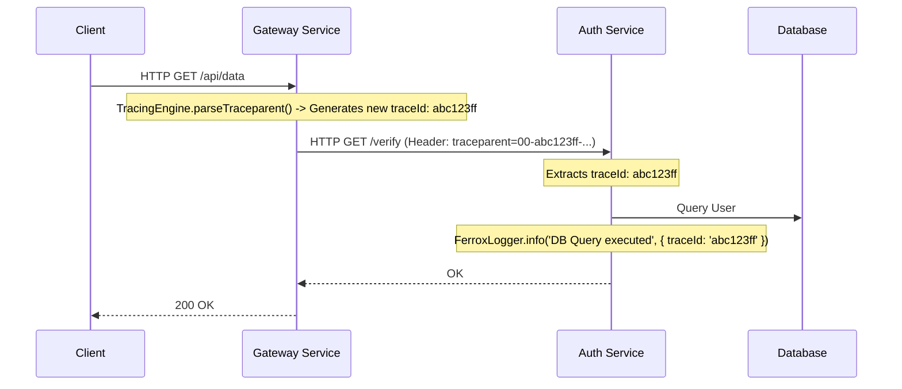

# 🔍 Distributed Tracing & Logging (`@node-yalc/tracing`)

## 💡 1. What It Is & Architectural Purpose
The `@node-yalc/tracing` module is the cornerstone of observability in the Ferrox Framework. Its architectural purpose is to generate, parse, and propagate **W3C Trace Context headers (`traceparent`)** across microservice boundaries, ensuring that every log entry, database query, and HTTP request belonging to a single user journey is cryptographically tied to a single `traceId`.

---

## ⚙️ 2. Comprehensive Taxonomy & Key Features

| Utility | Description | Use Case |
| :--- | :--- | :--- |
| **`TracingEngine`** | W3C header parser and generator. | Extracting `traceId` and `spanId` from an incoming request, or generating a fresh context if none exists. |
| **`TraceContext`** | Standardized interface. | Carrying tracing metadata through function calls (often stored in Node's `AsyncLocalStorage`). |
| **`FerroxLogger`** | JSON-based structured logger. | Emitting logs to `stdout` that automatically serialize meta objects (including `traceId`), perfectly optimized for Elasticsearch or Datadog. |

---

## 🔬 3. How It Works Under the Hood

When a request enters the Gateway Service, it lacks a `traceparent` header. The `TracingEngine` generates a cryptographically random 16-byte `traceId`. This ID is injected into every subsequent HTTP call to downstream microservices.



When logs from both `Gateway` and `Auth` are aggregated in Splunk or Datadog, searching for `abc123ff` immediately pulls up the entire sequential timeline across both services.

---

## 🧠 4. Why It Was Designed This Way (Rationale)

Without distributed tracing, debugging a failure in a microservices architecture is nearly impossible. A user gets a 500 error, but the actual failure happened 3 services deep in the call stack. 

By strictly adhering to the **W3C Trace Context specification**, `@node-yalc/tracing` ensures interoperability. If you inject a `traceparent` into a request bound for an AWS API Gateway or a Jaeger APM agent, they will natively understand it and stitch the trace together without needing vendor-specific (`X-B3-TraceId`, `X-Amzn-Trace-Id`) headers.

---

## 🚀 5. Practical Usage Guide & Extended Code Examples

### 1. Intercepting and Generating Traces

In your HTTP middleware, you extract the trace context and pass it into your logger.

```typescript
import { TracingEngine, FerroxLogger } from '@node-yalc/tracing';

const logger = new FerroxLogger('payment-service');

export function tracingMiddleware(req, res, next) {
  // 1. Extract or generate Trace Context
  const traceCtx = TracingEngine.parseTraceparent(req.headers['traceparent']);
  
  // 2. Attach to request for downstream usage
  req.traceContext = traceCtx;
  
  // 3. Ensure outbound responses include the header (useful for client-side debugging)
  res.setHeader('traceparent', TracingEngine.formatTraceparent(traceCtx));

  // 4. Log the incoming request
  logger.info(`Incoming ${req.method} ${req.url}`, { traceId: traceCtx.traceId });
  
  next();
}
```

### 2. Propagating to Downstream Services

When making an HTTP call to another internal microservice, you must pass the context forward.

```typescript
import { TracingEngine } from '@node-yalc/tracing';

async function callInventoryService(req) {
  const response = await fetch('http://inventory-service/api/stock', {
    headers: {
      // Propagate the exact trace format
      'traceparent': TracingEngine.formatTraceparent(req.traceContext)
    }
  });
  return response.json();
}
```

---

## ⚠️ 6. Anti-Patterns: How NOT to Use It

> [!CAUTION]
> **Anti-Pattern 1: Logging unstructured text**
> Do not use `logger.info(\`User ${id} trace: ${traceId}\`)`. The `FerroxLogger` expects stringified JSON out of the box. By concatenating variables into the string message, you defeat the purpose of structured logging, as Elasticsearch cannot index the `traceId` property if it's trapped inside a generic string message. Always pass variables in the `meta` object.

---

## 💡 7. Pro-Tips & Best Practices

> [!TIP]
> **Pro-Tip: AsyncLocalStorage Integration**
> Manually passing `req.traceContext` down through 10 layers of nested functions is tedious. Instead, leverage Node's `AsyncLocalStorage` in your middleware to store the `TraceContext`. You can then retrieve the `traceId` anywhere in the call stack globally, automatically injecting it into every database call or outgoing HTTP request.
