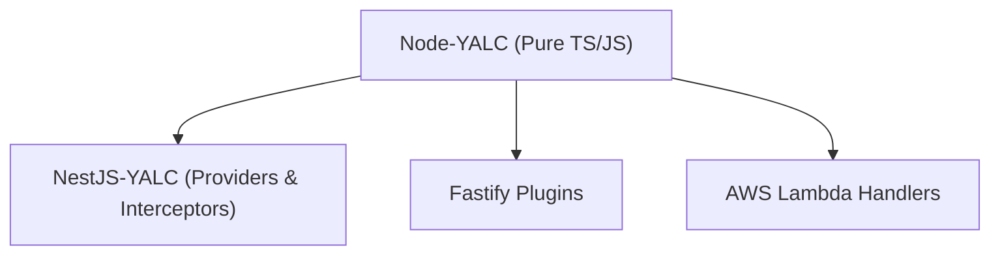

# 🚀 Node-YALC Overview

## 💡 1. What It Is & Architectural Purpose

**Node-YALC** is the pure Node.js and TypeScript foundation of the Ferrox ecosystem. It serves as the bedrock for all business logic, generic utilities, and shared interfaces. Unlike `nestjs-yalc`, which is tightly coupled to the NestJS dependency injection system, `node-yalc` is entirely framework agnostic. It can be executed seamlessly in Express, Fastify, NestJS, serverless Lambda functions, or raw Node scripts.

---

## ⚙️ 2. Comprehensive Taxonomy & Key Features

Node-YALC maps directly to the foundational layers of the Ferrox 7-Layer Architecture:

- **Layer 1 (Foundations)**: Centralized enumerations, value objects, and environment utilities (`@node-yalc/common`).
- **Layer 2 (Observability)**: Pure Pino wrapper for standardized JSON logging (`@node-yalc/logger`).
- **Layer 3 (Security)**: Base identity contracts and token parsers (`@node-yalc/auth`).
- **Layer 5 (Transports)**: Generic HTTP clients and typed event buses (`@node-yalc/transports`, `@node-yalc/event-manager`).

---

## 🔬 3. How It Works Under the Hood

In a typical enterprise setup, `node-yalc` is included as a core dependency. Other frameworks then provide the specific "glue" to wire these pure components into their lifecycles.



---

## 🧠 4. Why It Was Designed This Way (Rationale)

Frameworks come and go, but domain logic and core enterprise standards persist. By decoupling the fundamental building blocks (like error handling and logging) from the HTTP framework, the Ferrox architecture ensures absolute portability. If an enterprise decides to migrate from NestJS to Fastify, the underlying domain logic provided by `node-yalc` remains completely untouched.

---

## 🚀 5. Practical Usage Guide & Extended Code Examples

The most common entry point for developers is leveraging the shared error hierarchy and logging system.

```typescript
import { YalcLogger } from '@node-yalc/logger';
import { NotFoundError } from '@node-yalc/errors';

const logger = new YalcLogger({ level: 'info' });

export function findRecord(id: string) {
  logger.info(`Searching for record ${id}`);
  
  const record = null;
  if (!record) {
    logger.warn(`Record ${id} not found`);
    throw new NotFoundError(`Unable to locate resource`, { requestedId: id });
  }
  
  return record;
}
```

---

## ⚠️ 6. Anti-Patterns: How NOT to Use It

> [!CAUTION]
> **Anti-Pattern 1: Adding Framework Dependencies**
> Never import `@nestjs/common` or `express` inside `node-yalc`. Doing so violates the framework agnostic principle and creates circular dependencies in the ecosystem.

---

## 💡 7. Pro-Tips & Best Practices

> [!TIP]
> **Pro-Tip 1: Read the Deep Dives**
> To understand how these core components are utilized in a full server environment, read the documentation for `[NestJS-YALC Overview](../../nestjs-yalc/overview.md)` which demonstrates the framework integration layer.
