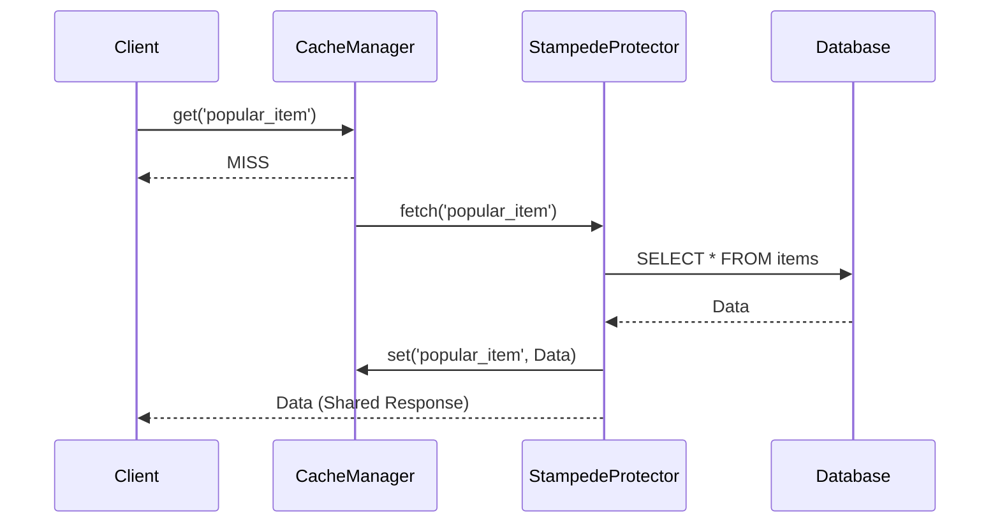

# ⚡ Memory & Redis Caching (`@yalc/performance/cache`)

## 💡 1. What It Is & Architectural Purpose
The `@yalc/performance/cache` module provides a unified, multi-tier caching abstraction. Its architectural purpose is to dramatically reduce database load and API latency by offering both local in-memory LRU caching (tier 1) and distributed Redis caching (tier 2) behind a single interface.

---

## ⚙️ 2. Comprehensive Taxonomy & Key Features

| Component | Description | Use Case |
| :--- | :--- | :--- |
| **`CacheManager`** | Unified API for setting and getting cached data. | General application caching. |
| **`MemoryDriver`** | High-speed LRU (Least Recently Used) cache. | Caching immutable configuration data. |
| **`RedisDriver`** | Distributed cache using `ioredis`. | Sharing cache across microservice instances. |
| **`StampedeProtector`** | Singleflight deduplication for cache misses. | Preventing database meltdown on key expiration. |

---

## 🔬 3. How It Works Under the Hood

When a cache miss occurs, the system utilizes the `StampedeProtector` (Singleflight pattern) to ensure that if 1,000 concurrent requests ask for the same missing key, only ONE query is dispatched to the database. The other 999 requests wait for the first one to populate the cache.



---

## 🧠 4. Why It Was Designed This Way (Rationale)

Standard caching solutions like `node-cache` or raw `redis` clients do not inherently protect against cache stampedes (thundering herds). By building Singleflight into the core caching abstraction, Node-YALC guarantees stability even under sudden viral traffic spikes.

---

## 🚀 5. Usage Guide & Code Examples

### Implementing Multi-Tier Cache

```typescript
import { CacheManager, RedisDriver, MemoryDriver } from '@yalc/performance/cache';

const redisDriver = new RedisDriver({ host: 'localhost', port: 6379 });
const memoryDriver = new MemoryDriver({ maxItems: 1000 });

// Configure tier 1 (memory) and tier 2 (redis)
const cache = new CacheManager({
  tier1: memoryDriver,
  tier2: redisDriver,
  defaultTtl: 3600 // 1 hour
});

async function getUserProfile(userId: string) {
  return cache.getOrSet(`user:${userId}`, async () => {
    // This expensive DB call is protected from cache stampedes!
    return await database.users.find(userId);
  });
}
```

---

## ⚠️ 6. Anti-Patterns: How NOT to Use It

> [!WARNING]
> **Anti-Pattern 1: Caching User-Specific Mutable Data Globally**
> Never cache data tied to a specific user using a generic key like `dashboard_data`. Always namespace keys, e.g., `user:123:dashboard_data`, to prevent data leakage between sessions.

---

## 开启 7. Pro-Tips & Best Practices

> [!TIP]
> **Pro-Tip: Stale-While-Revalidate**
> Enable the `staleWhileRevalidate` option on the `CacheManager`. This allows the system to serve slightly expired data to the user instantly, while silently refreshing the cache in the background, ensuring 0ms perceived latency!
