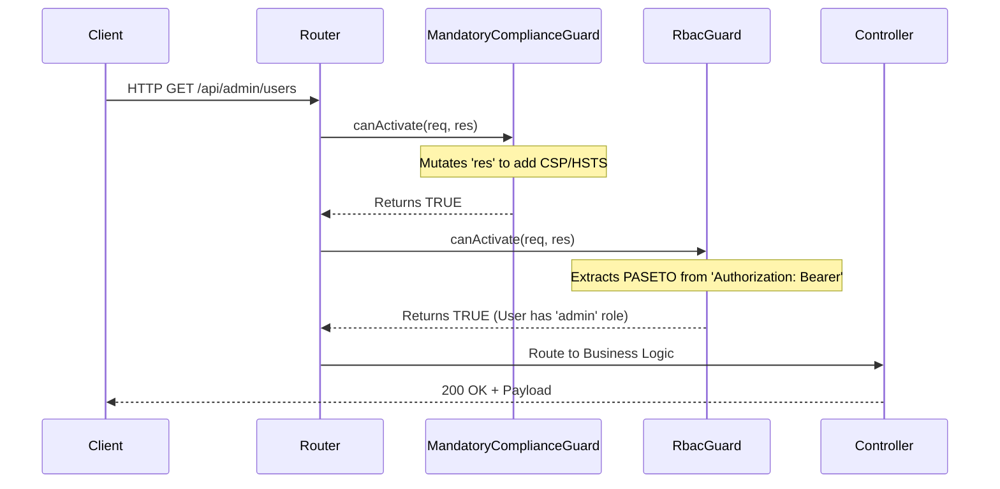

# 🛡️ Application Security Guards (`@node-yalc/guards`)

## 💡 1. What It Is & Architectural Purpose
The `@node-yalc/guards` module acts as the frontline defense mechanism for the Ferrox Framework. By providing pure TypeScript Guard classes (`MandatoryComplianceGuard` and `RbacGuard`), it enforces structural security constraints and Role-Based Access Control (RBAC) synchronously before any internal business logic or controllers are invoked. 

---

## ⚙️ 2. Comprehensive Taxonomy & Key Features

| Guard Class | Description | Primary Use Case |
| :--- | :--- | :--- |
| **`MandatoryComplianceGuard`** | Automatically injects security headers (HSTS, CSP, XSS) and blocks malicious User-Agents. | Globally bound to every HTTP server initialization to guarantee compliance with OWASP Top 10. |
| **`RbacGuard`** | PASETO v4.local Token parser and Role Verifier. | Protects sensitive routes by decoding cryptography-safe tokens and evaluating `payload.roles`. |

---

## 🔬 3. How It Works Under the Hood

When a request enters the application layer, the router passes the `FerroxHttpRequest` and `FerroxHttpResponse` through a chain of `.canActivate()` methods.



If any guard returns `false`, it immediately writes a `401 Unauthorized` or `403 Forbidden` response to the `res` object and terminates the execution lifecycle.

---

## 🧠 4. Why It Was Designed This Way (Rationale)

Many Node.js applications rely on Express/Fastify-specific middleware to handle authentication and header injections (e.g., `helmet` or `express-jwt`). While functional, these bind the security layer tightly to the HTTP framework.

By using simple classes exposing a `canActivate(req, res): boolean` contract, the `@node-yalc/guards` are fully decoupled. They can be trivially adapted into NestJS Interceptors, Fastify Hooks, or AWS Lambda Wrappers by simply checking their boolean return value.

---

## 🚀 5. Practical Usage Guide & Extended Code Examples

### 1. Global Compliance Enforcement

To enforce security headers across the entire application, bind the `MandatoryComplianceGuard` at the entry point of your server pipeline.

```typescript
import { MandatoryComplianceGuard } from '@node-yalc/guards';
import type { FerroxHttpRequest, FerroxHttpResponse } from '@node-yalc/transports';

const complianceGuard = new MandatoryComplianceGuard();

export function globalMiddleware(req: FerroxHttpRequest, res: FerroxHttpResponse) {
  const isCompliant = complianceGuard.canActivate(req, res);
  
  if (!isCompliant) {
    // Response was already mutated with a 403 status code.
    // Immediately halt request processing.
    return;
  }
  
  // Proceed with routing...
}
```

### 2. Protecting a Route with RBAC

To protect a specific endpoint, initialize the `RbacGuard` with the required roles and pass it the `PasetoAuthService`.

```typescript
import { RbacGuard } from '@node-yalc/guards';
import { PasetoAuthService } from '@node-yalc/auth';

const pasetoService = new PasetoAuthService(process.env.PASETO_LOCAL_SECRET);

// Require either 'admin' OR 'super-user' role
const adminGuard = new RbacGuard(pasetoService, ['admin', 'super-user']);

export function adminRouteHandler(req: any, res: any) {
  if (!adminGuard.canActivate(req, res)) {
    // A 401 or 403 was already sent by the guard
    return;
  }
  
  // At this point, req.user is guaranteed to be populated by the PASETO payload
  res.status(200).json({ data: `Welcome Admin ${req.user.email}` });
}
```

---

## ⚠️ 6. Anti-Patterns: How NOT to Use It

> [!CAUTION]
> **Anti-Pattern 1: Asynchronous Execution of Headers**
> `MandatoryComplianceGuard` expects to run immediately upon receiving the `IncomingMessage`. Do not place it after database lookups or body parsing middleware, as malicious payloads could exploit parsing vulnerabilities before the headers are injected.

> [!WARNING]
> **Anti-Pattern 2: Manual Token Fallbacks**
> `RbacGuard` strictly enforces the `Authorization: Bearer <PASETO-TOKEN>` header. Do not try to extract tokens from cookies, query parameters (`?token=`), or custom headers (`x-api-key`) inside this guard, as it bypasses CSRF protections.

---

## 💡 7. Pro-Tips & Best Practices

> [!TIP]
> **Pro-Tip: Integrating with NestJS-YALC**
> In the `nestjs-yalc` monorepo, these pure Guards are extended by wrapping them inside NestJS's `@Injectable()` `CanActivate` interfaces. This allows you to leverage Nest's `@SetMetadata('roles', ['admin'])` reflector to dynamically pass `requiredRoles` to the `RbacGuard` engine constructor at runtime.
