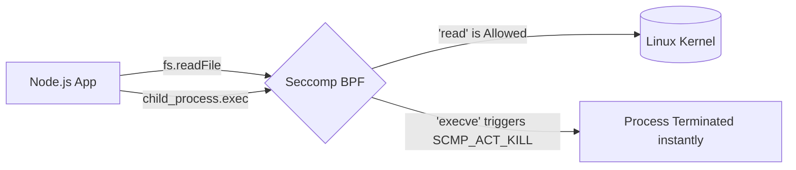

# 🛡️ OS Kernel Sandboxing (`@node-yalc/kernel`)

## 💡 1. What It Is & Architectural Purpose
The `@node-yalc/kernel` module is an infrastructure-as-code (IaC) utility built into the Ferrox Security ecosystem. Its architectural purpose is to dynamically generate hardened OS-level policies (Linux Seccomp BPF, Landlock LSM, and Sysctl configs) that strictly sandbox the Node.js runtime. By restricting what the Node.js process is permitted to do at the kernel level, it effectively neutralizes zero-day Remote Code Execution (RCE) vulnerabilities.

---

## ⚙️ 2. Comprehensive Taxonomy & Key Features

| Utility | Description | Security Purpose |
| :--- | :--- | :--- |
| **`KernelSandboxEngine`** | Core generation engine. | Encapsulates the logic for creating security profiles. |
| **`.generateSeccompBpfPolicy()`** | Generates Docker/K8s compatible JSON filters. | Blocks shell injections by killing `execve` and `ptrace` system calls. |
| **`.generateLandlockPolicy()`** | Generates LSM filesystem rules. | Creates an unprivileged chroot-like filesystem sandbox, blocking unauthorized read/writes outside `/app`. |
| **`.generateSysctlHardeningConfig()`** | Generates raw `sysctl.conf` blocks. | Mitigates network (SYN floods, IP spoofing) and filesystem (symlink) attacks. |

---

## 🔬 3. How It Works Under the Hood

### Seccomp BPF Flow
When you run a Docker container using the generated Seccomp profile, the Linux kernel intercepts every system call made by V8/Node.js.



By ensuring `execve` (execute file) is set to `SCMP_ACT_KILL`, even if an attacker successfully injects a reverse shell into your Express/Fastify routes, the kernel will kill the container before the shell can spawn.

---

## 🧠 4. Why It Was Designed This Way (Rationale)

Most Node.js applications rely purely on application-level defenses (like Helmet.js or input sanitization). However, history has shown that underlying libraries (like XML parsers, image manipulators, or YAML loaders) can contain native C++ buffer overflows. 

By pushing the defense perimeter to the Linux kernel via `@node-yalc/kernel`, Ferrox ensures that a compromise in user space does not result in a compromised server. The engine provides these profiles out-of-the-box so DevOps engineers don't have to manually learn and write complex BPF filters.

---

## 🚀 5. Practical Usage Guide & Extended Code Examples

### 1. Generating CI/CD Hardening Files
During your CI build step, you can invoke a script that dumps these profiles to disk, so they can be bundled with your Docker Image or Helm Chart.

```typescript
import { KernelSandboxEngine } from '@node-yalc/kernel';
import * as fs from 'fs';

const engine = new KernelSandboxEngine();

// 1. Generate Seccomp JSON for Docker runtime
const seccompProfile = engine.generateSeccompBpfPolicy();
fs.writeFileSync('seccomp.json', seccompProfile);

// 2. Generate Sysctl configuration
const sysctl = engine.generateSysctlHardeningConfig();
fs.writeFileSync('99-ferrox-hardening.conf', sysctl);

// Usage in Docker run:
// docker run --security-opt seccomp=seccomp.json -p 3000:3000 my-api
```

### 2. Customizing Landlock LSM Rules
If your app strictly requires writing to `/mnt/data`, you can append custom rules to the Landlock generation.

```typescript
const landlockRules = engine.generateLandlockPolicy([
  { path: '/mnt/data', allowedAccess: ['read', 'write'] }
]);
```

---

## ⚠️ 6. Anti-Patterns: How NOT to Use It

> [!WARNING]
> **Anti-Pattern 1: Applying Seccomp blindly in Dev Environments**
> Do not apply the `execve`-blocking Seccomp profile on a developer's local machine. Local tools like `ts-node`, `nodemon`, or debuggers heavily rely on `execve` and `ptrace`. If you apply this locally, the development server will immediately crash.

> [!CAUTION]
> **Anti-Pattern 2: Disabling TCP Syncookies in Sysctl**
> The engine strictly sets `net.ipv4.tcp_syncookies = 1`. Do not override this in production, as doing so makes the Node.js server highly vulnerable to TCP SYN flood DDoS attacks at the networking layer.

---

## 💡 7. Pro-Tips & Best Practices

> [!TIP]
> **Pro-Tip: Kubernetes Integration**
> Pass the generated `sysctl` strings into your Kubernetes Pod `securityContext.sysctls` array, and mount the `seccomp.json` into the Kubelet to fully lock down your Pods without requiring privileged mode.
