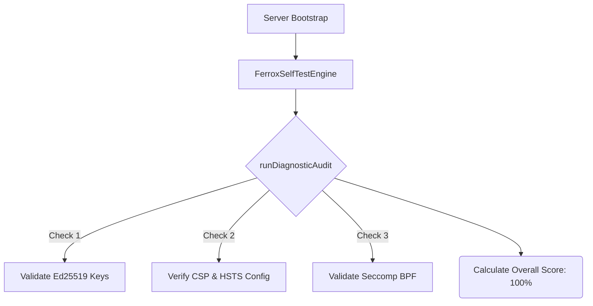

# 🩺 Diagnostics & Red-Team Audit (`@node-yalc/selftest`)

## 💡 1. What It Is & Architectural Purpose
The `@node-yalc/selftest` module provides an automated, built-in security diagnostics engine. Its architectural purpose is to allow the Node.js application to introspect its own runtime environment, ensuring that critical security headers, kernel sandboxes (Seccomp/Landlock), and AI guardrails are correctly configured before processing traffic. It also integrates a simulated Red-Team audit reporting layer (`KaliAuditReport`).

---

## ⚙️ 2. Comprehensive Taxonomy & Key Features

| Utility | Description | Use Case |
| :--- | :--- | :--- |
| **`FerroxSelfTestEngine`** | Core diagnostics class. | Instantiated during application startup to verify the server's security posture. |
| **`.runDiagnosticAudit()`** | Internal configuration verification. | Returning a 0-100 score on whether the PASETO encryption, headers, and Sysctl hardening are active. |
| **`.runKaliRedTeamAudit()`** | Simulated offensive security report. | Generating formatted JSON reports documenting how the API holds up against Nmap, Gobuster, SQLMap, Commix, and Hydra. |

---

## 🔬 3. How It Works Under the Hood

The self-test engine aggregates data from the other security modules (like `guards`, `kernel`, and `auth`). 


If the overall score drops below an acceptable threshold (e.g., `< 100` in strict production environments), the microservice can be configured to halt startup (`process.exit(1)`) to prevent a misconfigured container from accepting traffic.

---

## 🧠 4. Why It Was Designed This Way (Rationale)

A common point of failure in cloud deployments is environment misconfiguration. A developer might accidentally deploy to production without setting the `PASETO_SECRET`, or a Kubernetes operator might strip out the `securityContext` preventing the `seccomp.json` from loading.

By building the self-test engine *directly into* the application code, the server can verify its own OS-level and HTTP-level security bindings at boot, eliminating entire categories of deployment-related vulnerabilities.

---

## 🚀 5. Practical Usage Guide & Extended Code Examples

### 1. Hardening Server Startup

You can use the engine to halt application initialization if security requirements are not met.

```typescript
import { FerroxSelfTestEngine } from '@node-yalc/selftest';

async function bootstrap() {
  const engine = new FerroxSelfTestEngine();
  const { results, overallScore } = engine.runDiagnosticAudit();

  console.log(`Security Score: ${overallScore}%`);

  if (overallScore < 100 && process.env.NODE_ENV === 'production') {
    console.error('CRITICAL: Security configurations are missing. Halting startup.');
    console.table(results);
    process.exit(1);
  }

  // Continue starting HTTP server...
}
```

### 2. Exposing a Health Check Endpoint for Load Balancers

You can expose the simulated Red-Team audit or diagnostic report securely so your DevOps dashboards (or AWS Route53 Health Checks) can monitor the security state.

```typescript
export function securityHealthEndpoint(req, res) {
  // Ensure this endpoint is protected by your RbacGuard!
  const engine = new FerroxSelfTestEngine();
  const report = engine.runKaliRedTeamAudit('https://api.ferrox.dev');
  
  res.json(report);
}
```

---

## ⚠️ 6. Anti-Patterns: How NOT to Use It

> [!CAUTION]
> **Anti-Pattern 1: Exposing Audits Publicly**
> Never expose the output of `runDiagnosticAudit()` or `runKaliRedTeamAudit()` on a public endpoint without `RbacGuard` protection. Providing an attacker with a detailed report of your exact security posture, open ports, and active mitigations is an unnecessary information leak.

---

## 💡 7. Pro-Tips & Best Practices

> [!TIP]
> **Pro-Tip: Integrating with CI/CD Pipelines**
> Write a Jest test suite that instantiates `FerroxSelfTestEngine` and asserts `expect(overallScore).toBe(100)`. This guarantees that nobody accidentally disables a critical security module during a pull request, as the CI build will fail automatically.
