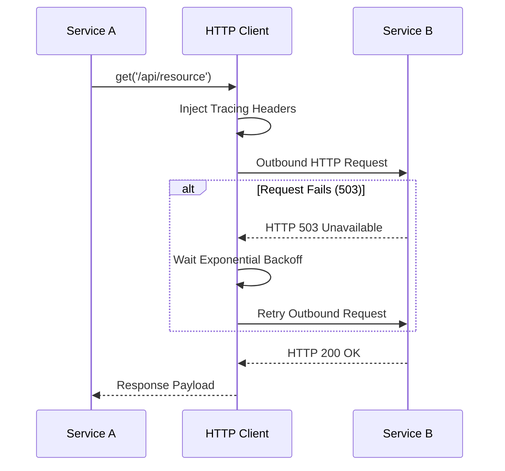

# 🌐 HTTP & RPC Transports (`@node-yalc/transports`)

## 💡 1. What It Is & Architectural Purpose

The `@node-yalc/transports` module operates at Layer 5 of the Ferrox Architecture. It provides a high-performance HTTP client optimized for microservice-to-microservice communication, alongside utilities for RPC calls. It abstracts away the unreliability of networks by providing built-in resilience patterns.

---

## ⚙️ 2. Comprehensive Taxonomy & Key Features

- **Exponential Backoff Retries**: Automatically retries failed network requests (e.g., HTTP 502, 503, 504) with increasing delays.
- **Circuit Breaking Integration**: Prevents cascading failures by failing fast when a downstream service is unresponsive.
- **Distributed Tracing**: Automatically propagates B3 and W3C trace headers to maintain request context across boundaries.

---

## 🔬 3. How It Works Under the Hood

When a request is initiated, the HTTP client intercepts the outbound call. It reads the ambient request context from `[@node-yalc/common](../fundamentals/common.md)` and injects the necessary tracing headers.



---

## 🧠 4. Why It Was Designed This Way (Rationale)

In a distributed microservice ecosystem, network failures are inevitable. Relying on standard `fetch` or `axios` requires engineers to manually implement retry logic and header propagation in every service. Centralizing this logic within `@node-yalc/transports` guarantees consistency, reduces boilerplate, and ensures all outbound calls comply with enterprise tracing standards.

---

## 🚀 5. Practical Usage Guide & Extended Code Examples

### Initializing the Resilient Client

```typescript
import { HttpClient } from '@node-yalc/transports/http';

const client = new HttpClient({ 
  baseURL: 'http://api.internal.svc.cluster.local' 
});

async function fetchResource() {
  const response = await client.get('/users/1', {
    retries: 3,
    timeout: 5000,
  });
  return response.data;
}
```

---

## ⚠️ 6. Anti-Patterns: How NOT to Use It

> [!CAUTION]
> **Anti-Pattern 1: Infinite Retries on 4xx Errors**
> Do not configure the client to retry on client errors like HTTP 400 or 401. Retries should only apply to transient server errors (HTTP 5xx) or network timeouts.

---

## 💡 7. Pro-Tips & Best Practices

> [!TIP]
> **Pro-Tip 1: Combine with Application Errors**
> When the HTTP client exhausts all retries, catch the generic network error and wrap it in a strongly typed exception using `[@node-yalc/errors](../fundamentals/errors.md)` (e.g., `BadGatewayError`) before propagating it to the UI.


---

## 🔗 Cross-References

To see how this module integrates with the rest of the Ferrox architecture, refer to the following documentation:

- [Node-YALC Errors](../fundamentals/errors.md)
